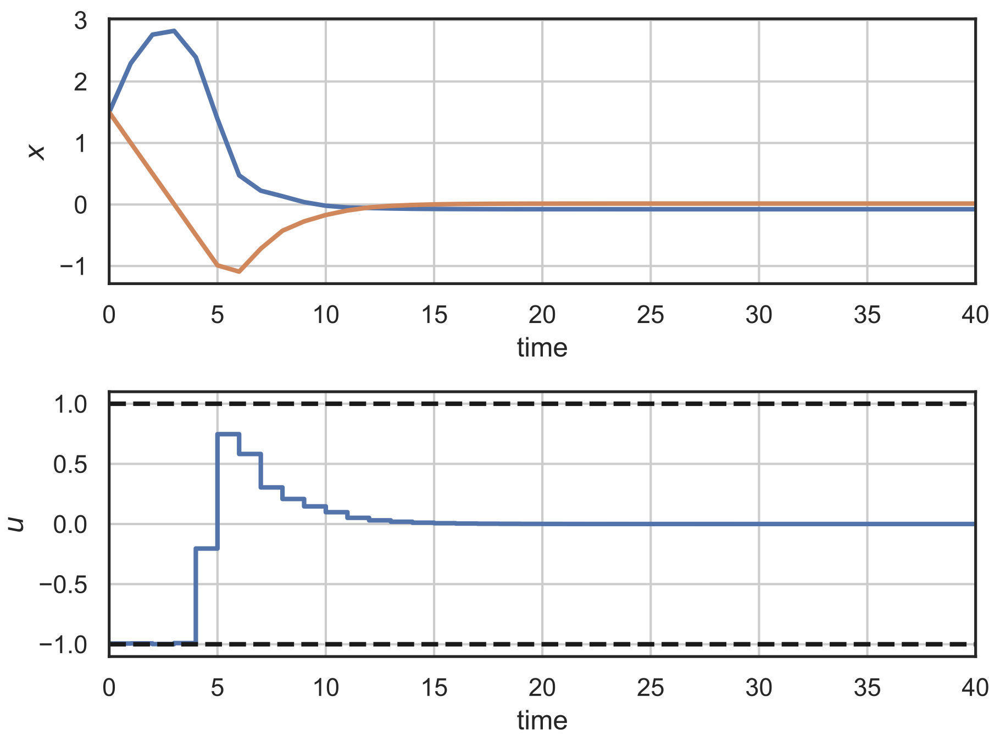
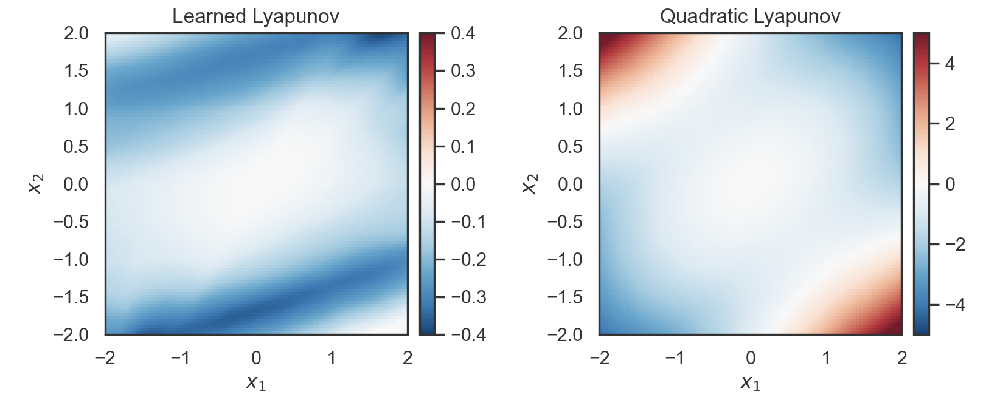
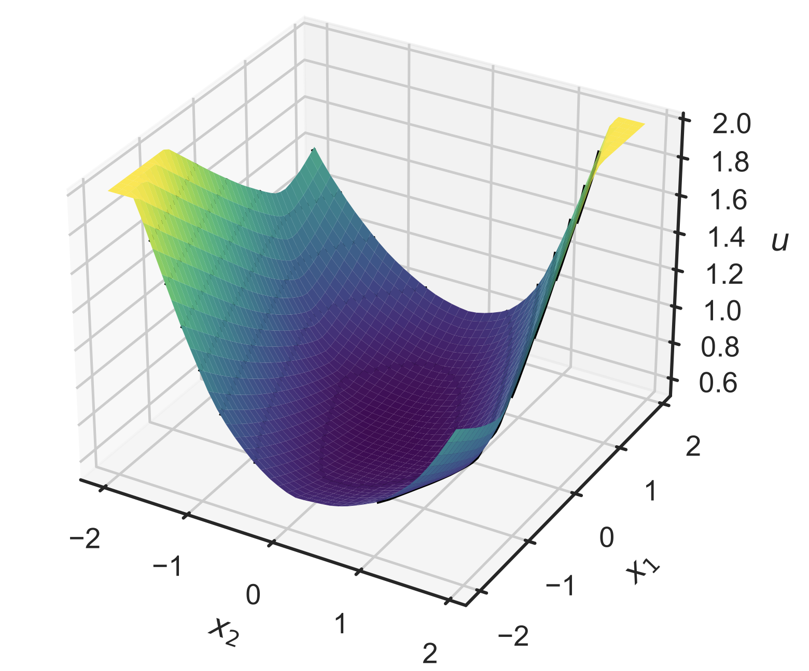
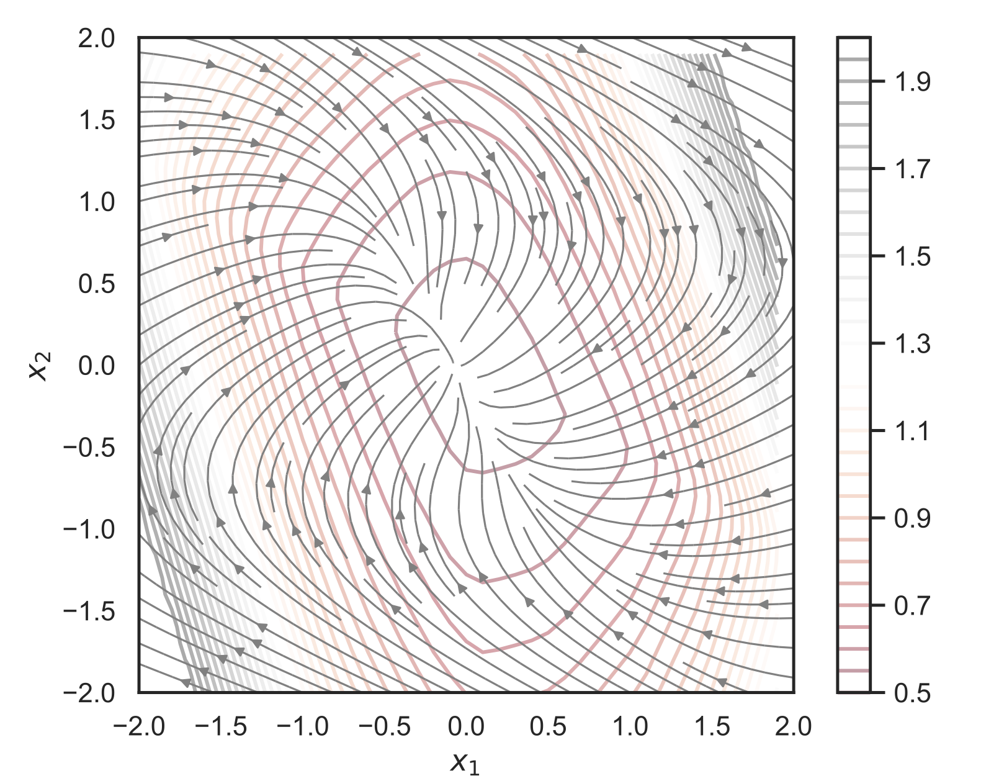
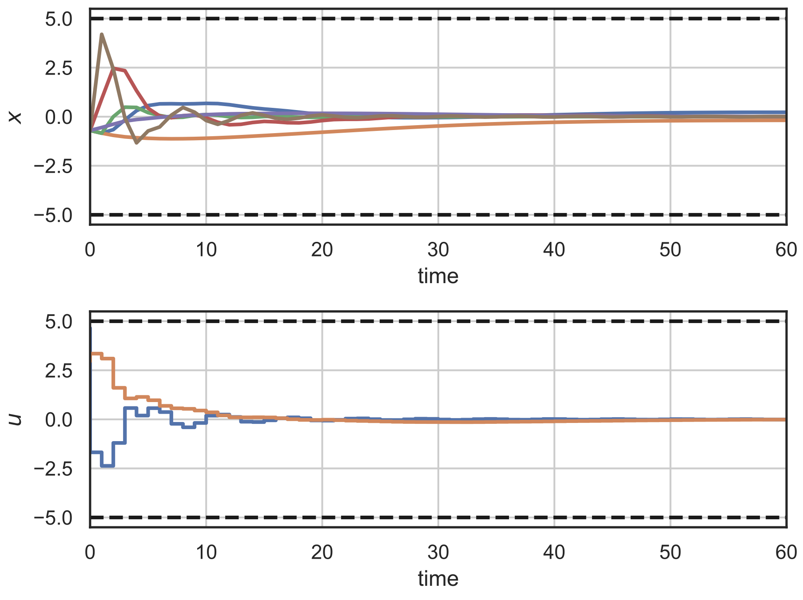
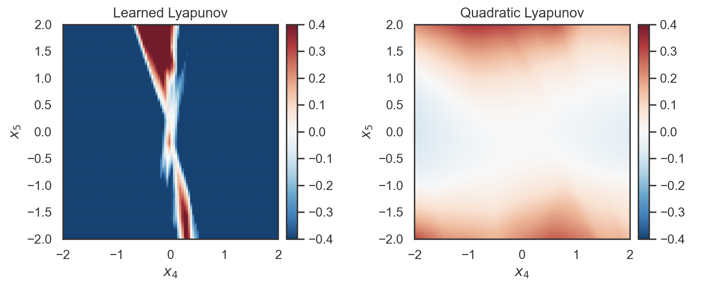
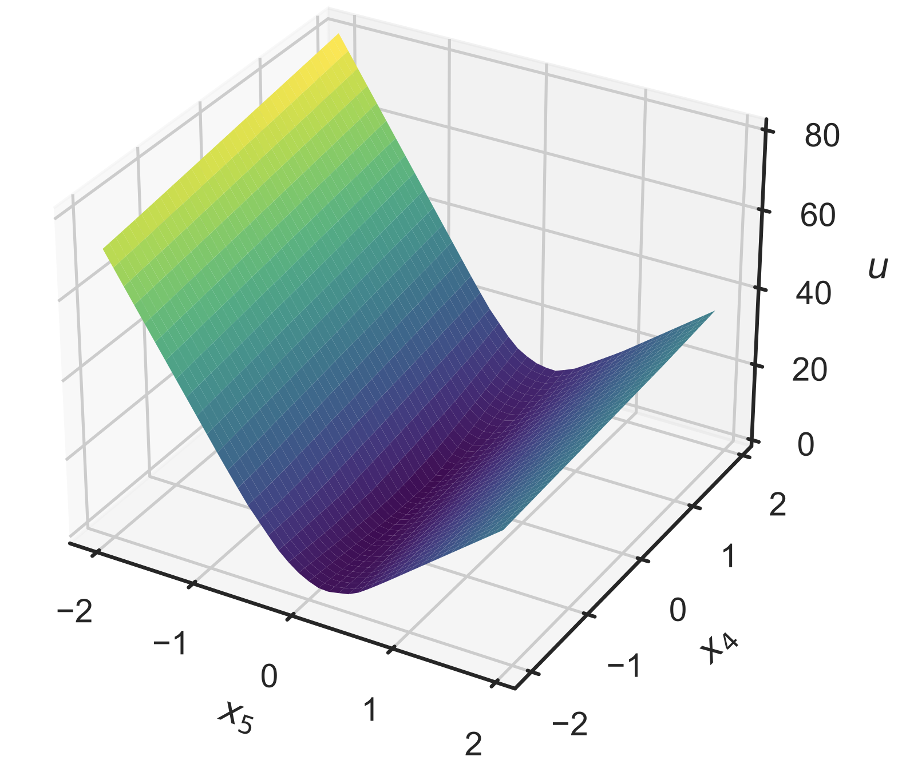
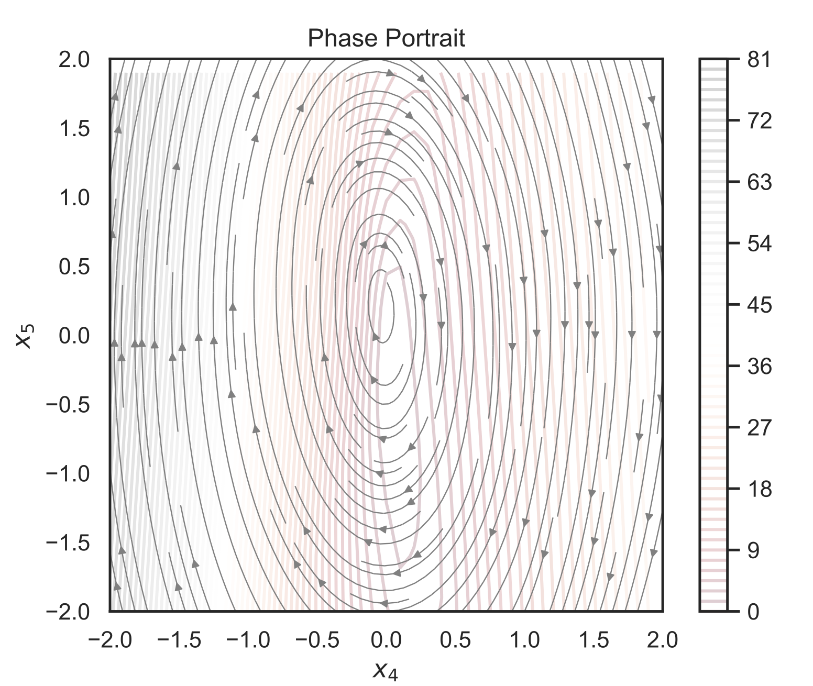

# Neural Lyapunov Differentiable Predictive Control 
Code for the paper [Neural Lyapunov Differentiable Predictive Control](https://arxiv.org/abs/2205.10728)

Neural Lyapunov DPC combines the principles of Lyapunov functions, model predictive control, reinforcement learning, and differentiable programming to offer a systematic way for offline unsupervised model-based policy optimization with goal-parametrized domain-aware intrinsic rewards.


## Method and Examples

  
*Conceptual methodology of the neural Lyapunov differentiable predictive control. 
Simulation of the differentiable constrained closed-loop system dynamics with neural Lyapunov function 
in the forward pass is followed by backward pass computing direct policy gradients for policy optimization*


  
*Example 1: Closed-loop state and control trajectories for
double integrator.*

  
*Example 1: Stability regions via discrete-time Lyapunov stability
condition (5) for double integrator.*

  
*Example 1: Learned Lyapunov function for double integrator.*

  
*Example 1: Closed-loop phase portrait with overlaid Lyapunov
contours for double integrator.*


  
*Example 2: Closed-loop state and control trajectories for
PVTOL aircraft.*

  
*Example 2: Stability regions via discrete-time Lyapunov stability
condition (5) for PVTOL aircraft. Visualized on 2D slice of
the 6D state space.*

  
*Example 2: Learned Lyapunov function for PVTOL
aircraft. Visualized on 2D slice of the 6D state space.*

  
*Example 2: Closed-loop phase portrait with overlaid Lyapunov
contours for PVTOL aircraft. Visualized on 2D slice of the 6D
state space.*


## Cite as

```yaml
@misc{mukherjee2022neural,
      title={Neural Lyapunov Differentiable Predictive Control}, 
      author={Sayak Mukherjee and Ján Drgoňa and Aaron Tuor and Mahantesh Halappanavar and Draguna Vrabie},
      year={2022},
      eprint={2205.10728},
      archivePrefix={arXiv},
      primaryClass={eess.SY}
}
```


## Files for Running the Neural Lyapunov Differentiable Predictive Control Examples

examples are stored in the folder: .\examples\control_ODE\Lyapunov_DPC\

### Example 1: double integrator
- double_integrator_LyapDPC_nstep.py - DPC stabilization double integrator example 
- double_integrator_LyapDPC_var_ref.py - DPC reference tracking double integrator example 

### Example 2: pvtol aircraft model
- vtol_aircraft_LyapDPC_stabilize.py - DPC stabilization pvtol model example 

