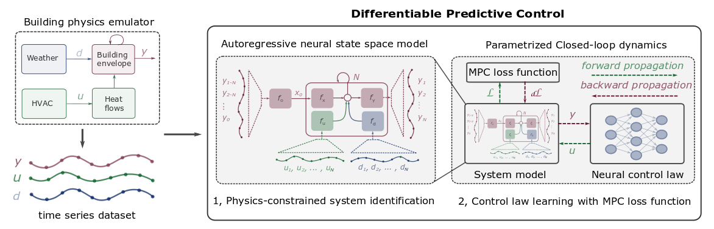
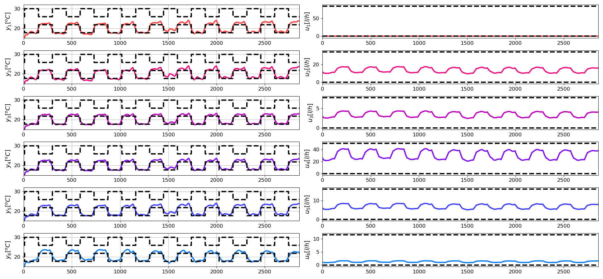
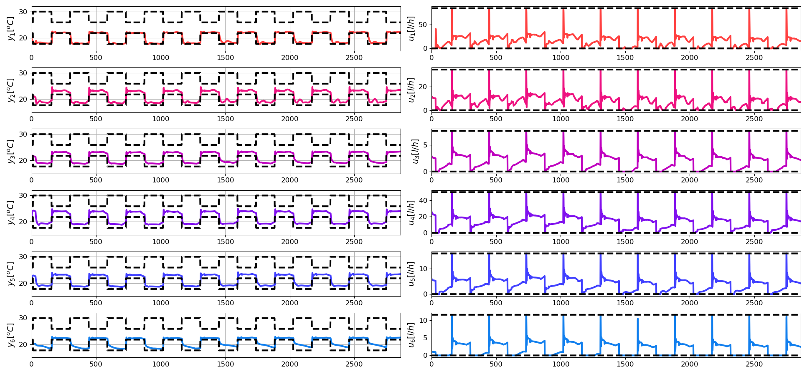

# NeuroMANCER
## Neural Modules with Adaptive Nonlinear Constraints and 	Efficient Regularizations


## Setup

##### Clone and install neuromancer, linear maps, and emulator packages
```console
user@machine:~$ mkdir ecosystem; cd ecosystem
user@machine:~$ git clone https://gitlab.pnnl.gov/dadaist/neuromancer.git
user@machine:~$ git clone https://gitlab.pnnl.gov/dadaist/psl.git
user@machine:~$ git clone https://gitlab.pnnl.gov/dadaist/slim.git

# Resulting file structure:
    ecosystem/
        neuromancer/
        psl/
        slim/
```

##### Create the environment via .yml (Linux)

```console
user@machine:~$ conda env create -f env.yml
(neuromancer) user@machine:~$ source activate neuromancer
```

##### If .yml env creation fails create the environment manually

```console
user@machine:~$ conda config --add channels conda-forge pytorch
user@machine:~$ conda create -n neuromancer python=3.7
user@machine:~$ source activate neuromancer
(neuromancer) user@machine:~$ conda install pytorch torchvision -c pytorch
(neuromancer) user@machine:~$ conda install scipy pandas matplotlib control pyts numba scikit-learn mlflow dill
(neuromancer) user@machine:~$ conda install -c powerai gym
```

##### install neuromancer ecosystem 

```console
(neuromancer) user@machine:~$ cd psl
(neuromancer) user@machine:~$ python setup.py develop
(neuromancer) user@machine:~$ cd ../slim
(neuromancer) user@machine:~$ python setup.py develop
(neuromancer) user@machine:~$ cd ../neuromancer
(neuromancer) user@machine:~$ python setup.py develop
```


### IFAC NMPC 2021 Branch 
Building modeling and control experiments using differentiable predictive control (DPC).


TODO: add arxiv link



*Conceptual methodology.*

#### Paper results

Left column: temperature profiles of six zones with corresponding constraints (dashed-black).  
Right column: Mass flow profiles with with corresponding constraints (dashed-black).


*Closed-loop control of the nominal model with DPC control policy.*

Due to the unmodeled plant-model mismatch the DPC policy trained using nominal model might get unstable.
In this work we fix this by introducing simple PI feedback to correct the control errors.


*Closed-loop control of the emulator model with DPC control policy and PI feedback correctors.*


#### Run experiments

Setup system identification with neural state space models:
[system_id](neuromancer/train_scripts/papers/nmpc2020_buildings/setup_system_id.py)  
Run system identification with neural state space models:
[system_id](neuromancer/train_scripts/papers/nmpc2020_buildings/system_id.py)  
Setup DPC problem and architecture:
[control](neuromancer/train_scripts/papers/nmpc2020_buildings/control.py)  
Run DPC control policy optimization and closed-loop control:
[control](neuromancer/train_scripts/papers/nmpc2020_buildings/control.py)


#### Cite as

@misc{DPC_explicit_2021,
      title={Deep Learning Explicit Differentiable Predictive Control Laws for Buildings}, 
      author={Jan Drgoňa and Aaron Tuor and Elliott Skomski and Soumya Vasisht and Draguna Vrabie},
      year={2021},
      booktitle={IFAC Nonlinear Model Predictive Control (NMPC) Conference}
}
