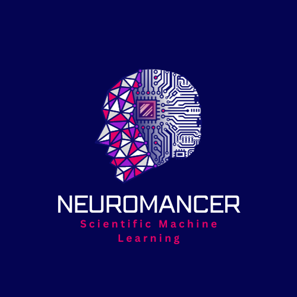

<p align="center">
    
</p>

# NeuroMANCER v1.5.3

[](https://pypi.org/project/neuromancer)
[](https://github.com/pnnl/neuromancer/blob/master/LICENSE.md)
[](https://pnnl.github.io/neuromancer/)


**Neural Modules with Adaptive Nonlinear Constraints and Efficient Regularizations (NeuroMANCER)**
is an open-source differentiable programming (DP) library for solving parametric constrained optimization problems, 
physics-informed system identification, and parametric model-based optimal control.
NeuroMANCER is written in [PyTorch](https://pytorch.org/) and allows for systematic 
integration of machine learning with scientific computing for creating end-to-end 
differentiable models and algorithms embedded with prior knowledge and physics.

---

## Table of Contents
1. [Overview](#overview)
2. [Key Features](#key-features)
3. [What's New in v1.5.3](#whats-new-in-v153)
4. [Installation](#installation)
5. [Getting Started](#getting-started)
6. [Tutorials](#domain-examples)
6. [Documentation and User Guides](#documentation-and-user-guides)


---

### Key Features
* **Learn To Model, Learn To Control, Learn To Optimize**: Our library is built to provide end users a multitude of tools to solve Learning To Optimize (L2O), Learning To Model (L2M), and Learning To Control (L2C) tasks. Tackle advanced constrained parametric optimization, model fluid dynamics using physics-informed neural networks, or learn how to control indoor air temperature in buildings to maximize building efficiency.
* **Symbolic programming** interface makes it very easy to define embed prior knowledge of physics, domain knowledge, and constraints into those learning paradigms. 
* **Comprehensive Learning Tools**: Access a wide array of tutorials and example applications—from basic system identification to advanced predictive control—making it easy for users to learn and apply NeuroMANCER to real-world problems.
* **State-of-the-art methods**: NeuroMANCER is up-to-date with SOTA methods such as Kolgomorov-Arnold Networks (KANs) for function approximation, neural ordinary differential equations (NODEs) and sparse identification of non-linear dynamics (SINDy) for learning to model dynamical systems, and differentiable convex optimization layers for safety constraints in learning to optimize and learning to control.


## What's New in v1.5.3
### The NeuroMANCER-GPT Assistant

We provide the easy-to-use scripts to convert the contents of the NeuroMANCER library in a way that is suitable for ingestion in RAG-based "LLM-assistant" pipelines. Please see [Assistant](https://github.com/pnnl/neuromancer/blob/develop/assistant/README.md) to read more about how one can quickly spin-up an LLM model to help understand and code in NeuroMANCER. 

### Building Control Comparison: Reinforcement Learning vs Differential Predictive Control Example
We add to our growing library of building modeling and control tutorials a highly education and in-depth walkthrough of reinforcement learning (RL) methods and compare them to differential predictive control (DPC) in NeuroMANCER. This notebook shows that the while the RL solution is more adaptive, the DPC solution in NeuroMANCER is more energy-efficien, has smoother control actions, trains faster and is easier constraint enforcement.
### Python 3.11 Version Support
NeuroMANCER has been updated to support Python 3.11.
### New Feature: Improved Node Class
The Node class has been updated to accept instantiated Variable objects as well. The change is backwards-compatible and simplifies house-keeping for the user. 


**New Colab Examples:**
> ⭐ [Building Energy Systems Modeling and Control](#energy-systems)


## Installation
Simply run 
```
pip install neuromancer
```
For manual installation, please refer to  [Installation Instructions](INSTALLATION.md)


## Getting Started

An extensive set of tutorials can be found in the 
[examples](https://github.com/pnnl/neuromancer/tree/master/examples) folder and the [Tutorials](#domain-examples) below.
Interactive notebook versions of examples are available on Google Colab!
Test out NeuroMANCER functionality before cloning the repository and setting up an
environment.

The notebooks below introduce the core abstractions of the NeuroMANCER library, in particular, our symbolic programming interface and Node classes. 

### Symbolic Variables, Nodes, Constraints, Objectives, and Systems Classes

+ <a target="_blank" href="https://colab.research.google.com/github/pnnl/neuromancer/blob/master/examples/tutorials/part_1_linear_regression.ipynb"></a>
Part 1: Linear regression in PyTorch vs NeuroMANCER.  

+ <a target="_blank" href="https://colab.research.google.com/github/pnnl/neuromancer/blob/master/examples/tutorials/part_2_variable.ipynb"></a>
Part 2: NeuroMANCER syntax tutorial: variables, constraints, and objectives.  

+ <a target="_blank" href="https://colab.research.google.com/github/pnnl/neuromancer/blob/master/examples/tutorials/part_3_node.ipynb"></a>
Part 3: NeuroMANCER syntax tutorial: modules, Node, and System class.

### Example
Quick example for how to solve parametric constrained optimization problem using NeuroMANCER, leveraging our symbolic programming interface, Node and Variable, Blocks, SLiM library, and PenaltyLoss classes. 

```python 
# Neuromancer syntax example for constrained optimization
import neuromancer as nm
import torch 

# define neural architecture 
func = nm.modules.blocks.MLP(insize=1, outsize=2, 
                             linear_map=nm.slim.maps['linear'], 
                             nonlin=torch.nn.ReLU, hsizes=[80] * 4)
# wrap neural net into symbolic representation via the Node class: map(p) -> x
map = nm.system.Node(func, ['p'], ['x'], name='map')
    
# define decision variables
x = nm.constraint.variable("x")[:, [0]]
y = nm.constraint.variable("x")[:, [1]]
# problem parameters sampled in the dataset
p = nm.constraint.variable('p')

# define objective function
f = (1-x)**2 + (y-x**2)**2
obj = f.minimize(weight=1.0)

# define constraints
con_1 = 100.*(x >= y)
con_2 = 100.*(x**2+y**2 <= p**2)

# create penalty method-based loss function
loss = nm.loss.PenaltyLoss(objectives=[obj], constraints=[con_1, con_2])
# construct differentiable constrained optimization problem
problem = nm.problem.Problem(nodes=[map], loss=loss)
```


## Domain Examples

NeuroMANCER is built to tackle a variety of domain-specific modeling and control problems using its array of methods. Here we show how to model and control building energy systems, as well as apply load forecasting techniques. 

For more in-depth coverage of our methods, please see our general [Tutorials](#tutorials-on-methods-for-modeling-optimization-and-control) section below. 

### Energy Systems

+ <a target="_blank" href="https://colab.research.google.com/github/pnnl/neuromancer/blob/master/examples/domain_examples/NODE_building_dynamics.ipynb">
  </a> Learning Building Thermal Dynamics using Neural ODEs 

+ <a target="_blank" href="https://colab.research.google.com/github/pnnl/neuromancer/blob/master/examples/domain_examples/NODE_RC_networks.ipynb">
  </a> Multi-zone Building Thermal Dynamics Resistance-Capacitance network with Neural ODEs

+ <a target="_blank" href="https://colab.research.google.com/github/pnnl/neuromancer/blob/master/examples/domain_examples/NODE_swing_equation.ipynb">
  </a> Learning Swing Equation Dynamics using Neural ODEs


+ <a target="_blank" href="https://colab.research.google.com/github/pnnl/neuromancer/blob/master/examples/domain_examples/DPC_building_control.ipynb">
  </a> Learning to Control Indoor Air Temperature in Buildings


+ <a target="_blank" href="https://colab.research.google.com/github/pnnl/neuromancer/blob/master/examples/domain_examples/HVAC_load_forecasting.ipynb">
  </a> Energy Load Forecasting for Building with MLP and CNN Models

+ <a target="_blank" href="https://colab.research.google.com/github/pnnl/neuromancer/blob/master/examples/domain_examples/building_load_forecasting_Transformers.ipynb">
  </a>  Energy Load Forecasting for Building with Transformers Model


+ <a target="_blank" href="https://colab.research.google.com/github/pnnl/neuromancer/blob/master/examples/domain_examples/DPC_PSH.ipynb">
  </a> Learning to Control Pumped-storage Hyrdoelectricity System

+ <a target="_blank" href="https://github.com/pnnl/neuromancer/blob/master/examples/domain_examples/RL_DPC_building_control.ipynb">
  </a> Learning to Control a Building With Safe Reinforcement Learning and Differentiable Predictive Control


## Tutorials on Methods for Modeling, Optimization, and Control
### Learning to Optimize (L2O) Parametric Programming

Neuromancer allows you to formulate and solve a broad class of parametric optimization problems, leveraging machine learning to learn the solutions to such problems. [More information on Parametric programming](https://github.com/pnnl/neuromancer/tree/develop/examples/parametric_programming)

+ <a target="_blank" href="https://colab.research.google.com/github/pnnl/neuromancer/blob/master/examples/parametric_programming/Part_1_basics.ipynb"></a>
Part 1: Learning to solve a constrained optimization problem.

+ <a target="_blank" href="https://colab.research.google.com/github/pnnl/neuromancer/blob/master/examples/parametric_programming/Part_2_pQP.ipynb"></a>
Part 2: Learning to solve a quadratically-constrained optimization problem.

+ <a target="_blank" href="https://colab.research.google.com/github/pnnl/neuromancer/blob/master/examples/parametric_programming/Part_3_pNLP.ipynb"></a>
Part 3: Learning to solve a set of 2D constrained optimization problems.

+ <a target="_blank" href="https://colab.research.google.com/github/pnnl/neuromancer/blob/master/examples/parametric_programming/Part_4_projectedGradient.ipynb"></a> 
Part 4: Learning to solve a constrained optimization problem with the projected gradient.

+ <a target="_blank" href="https://colab.research.google.com/github/pnnl/neuromancer/blob/master/examples/parametric_programming/Part_5_cvxpy_layers.ipynb"></a> 
Part 5: Using Cvxpylayers for differentiable projection onto the polytopic feasible set.  

+ <a target="_blank" href="https://colab.research.google.com/github/pnnl/neuromancer/blob/master/examples/parametric_programming/Part_6_pQp_lopoCorrection.ipynb"></a> 
Part 6: Learning to optimize with metric learning for Operator Splitting layers.  

### Learning to Control (L2C)
Neuromancer allows you to learn control policies for a full spectrum of white/grey/black-box dynamical systems, subject to choice constraints and objective functions. 
[More information on Differential Predictive Control](https://github.com/pnnl/neuromancer/tree/develop/examples/control)

+ <a target="_blank" href="https://colab.research.google.com/github/pnnl/neuromancer/blob/master/examples/control/Part_1_stabilize_linear_system.ipynb">
  </a> Part 1: Learning to stabilize a linear dynamical system.

+ <a target="_blank" href="https://colab.research.google.com/github/pnnl/neuromancer/blob/master/examples/control/Part_2_stabilize_ODE.ipynb">
  </a> Part 2: Learning to stabilize a nonlinear differential equation.

+ <a target="_blank" href="https://colab.research.google.com/github/pnnl/neuromancer/blob/master/examples/control/Part_3_ref_tracking_ODE.ipynb">
  </a> Part 3: Learning to control a nonlinear differential equation.

+ <a target="_blank" href="https://colab.research.google.com/github/pnnl/neuromancer/blob/master/examples/control/Part_4_NODE_control.ipynb">
  </a> Part 4: Learning neural ODE model and control policy for an unknown dynamical system.

+ <a target="_blank" href="https://colab.research.google.com/github/pnnl/neuromancer/blob/master/examples/control/Part_5_neural_Lyapunov.ipynb">
  </a> Part 5: Learning neural Lyapunov function for a nonlinear dynamical system.

### Function Approximation
Neuromancer is up-to-date with state-of-the-art methods. Here we showcase the powerful Kolgomorov-Arnold networks [More information on Kolgomorov-Arnold Networks](https://github.com/pnnl/neuromancer/tree/develop/examples/KANs)
+ <a target="_blank" href="https://colab.research.google.com/github/pnnl/neuromancer/blob/feature/fbkans/examples/KANs/p1_fbkan_vs_kan_noise_data_1d.ipynb"></a> Part 1: A comparison of KANs and FBKANs in learning a 1D multiscale function with noise
+ <a target="_blank" href="https://colab.research.google.com/github/pnnl/neuromancer/blob/feature/fbkans/examples/KANs/p2_fbkan_vs_kan_noise_data_2d.ipynb"></a> Part 2: A comparison of KANs and FBKANs in learning a 2D multiscale function with noise


### System Identification
Neuromancer allows one to use machine learning, prior physics, and domain knowledge to construct data-driven models of dynamical systems given the measured observations of the system behavior.
[More information on System ID via Neural State Space Models and ODEs](https://github.com/pnnl/neuromancer/tree/develop/examples/ODEs)
+ <a target="_blank" href="https://colab.research.google.com/github/pnnl/neuromancer/blob/master/examples/ODEs/Part_1_NODE.ipynb">
  </a> Part 1: Neural Ordinary Differential Equations (NODEs)

+ <a target="_blank" href="https://colab.research.google.com/github/pnnl/neuromancer/blob/master/examples/ODEs/Part_2_param_estim_ODE.ipynb">
  </a> Part 2: Parameter estimation of ODE system

+ <a target="_blank" href="https://colab.research.google.com/github/pnnl/neuromancer/blob/master/examples/ODEs/Part_3_UDE.ipynb">
  </a> Part 3: Universal Differential Equations (UDEs)

+ <a target="_blank" href="https://colab.research.google.com/github/pnnl/neuromancer/blob/master/examples/ODEs/Part_4_nonauto_NODE.ipynb">
  </a> Part 4: NODEs with exogenous inputs

+ <a target="_blank" href="https://colab.research.google.com/github/pnnl/neuromancer/blob/master/examples/ODEs/Part_5_nonauto_NSSM.ipynb">
  </a> Part 5: Neural State Space Models (NSSMs) with exogenous inputs

+ <a target="_blank" href="https://colab.research.google.com/github/pnnl/neuromancer/blob/master/examples/ODEs/Part_6_NetworkODE.ipynb">
  </a> Part 6: Data-driven modeling of resistance-capacitance (RC) network ODEs

+ <a target="_blank" href="https://colab.research.google.com/github/pnnl/neuromancer/blob/master/examples/ODEs/Part_7_DeepKoopman.ipynb">
  </a> Part 7: Deep Koopman operator

+ <a target="_blank" href="https://colab.research.google.com/github/pnnl/neuromancer/blob/master/examples/ODEs/Part_8_nonauto_DeepKoopman.ipynb">
  </a> Part 8: control-oriented Deep Koopman operator

+ <a target="_blank" href="https://colab.research.google.com/github/pnnl/neuromancer/blob/master/examples/ODEs/Part_9_SINDy.ipynb">
  </a> Part 9: Sparse Identification of Nonlinear Dynamics (SINDy)


### Physics-Informed Neural Networks (PINNs)
Neuromancer's symbolic programming design is perfectly suited for solving PINNs. [More information on PINNs](https://github.com/pnnl/neuromancer/tree/develop/examples/PDEs)
+ <a target="_blank" href="https://colab.research.google.com/github/pnnl/neuromancer/blob/master/examples/PDEs/Part_1_PINN_DiffusionEquation.ipynb"></a> Part 1: Diffusion Equation
+ <a target="_blank" href="https://colab.research.google.com/github/pnnl/neuromancer/blob/master/examples/PDEs/Part_2_PINN_BurgersEquation.ipynb"></a> Part 2: Burgers' Equation
+ <a target="_blank" href="https://colab.research.google.com/github/pnnl/neuromancer/blob/master/examples/PDEs/Part_3_PINN_BurgersEquation_inverse.ipynb"></a> Part 3: Burgers' Equation w/ Parameter Estimation (Inverse Problem)
+ <a target="_blank" href="https://colab.research.google.com/github/pnnl/neuromancer/blob/master/examples/PDEs/Part_4_PINN_LaplaceEquationSteadyState.ipynb"></a> Part 4: Laplace's Equation (steady-state)
+ <a target="_blank" href="https://colab.research.google.com/github/pnnl/neuromancer/blob/master/examples/PDEs/Part_5_Pendulum_Stacked.ipynb"></a> Part 5: Damped Pendulum (stacked PINN)
+ <a target="_blank" href="https://colab.research.google.com/github/pnnl/neuromancer/blob/master/examples/PDEs/Part_6_PINN_NavierStokesCavitySteady_KAN.ipynb"></a> Part 6: Navier-Stokes equation (lid-driven cavity flow, steady-state, KAN)

### Stochastic Differential Equations (SDEs) 
Neuromancer has been integrated with TorchSDE to handle stochastic dynamical systems. [More information on SDEs](https://github.com/pnnl/neuromancer/tree/develop/examples/SDEs)
+ <a target="_blank" href="https://colab.research.google.com/github/pnnl/neuromancer/blob/master/examples/SDEs/sde_walkthrough.ipynb">
  </a> LatentSDEs: "System Identification" of Stochastic Processes using Neuromancer x TorchSDE


## Scalability and Customization

### PyTorch Lightning Integration

We have integrated PyTorch Lightning to streamline code, enable custom training logic, support GPU and multi-GPU setups, and handle large-scale, memory-intensive learning tasks.

+ <a target="_blank" href="https://colab.research.google.com/github/pnnl/neuromancer/blob/master/examples/lightning_integration_examples/Part_1_lightning_basics_tutorial.ipynb">
  </a> Part 1: Lightning Integration Basics.

+ <a target="_blank" href="https://colab.research.google.com/github/pnnl/neuromancer/blob/master/examples/lightning_integration_examples/Part_2_lightning_advanced_and_gpu_tutorial.ipynb">
  </a> Part 2: Lightning Advanced Features and Automatic GPU Support.

+ <a target="_blank" href="https://colab.research.google.com/github/pnnl/neuromancer/blob/master/examples/lightning_integration_examples/other_examples/lightning_custom_training_example.ipynb">
  </a> Part 3: Defining Custom Training Logic via Lightning Modularized Code.


## Documentation and User Guides
The documentation for the library can be found [online](https://pnnl.github.io/neuromancer/). 
There is also an [introduction video](https://www.youtube.com/watch?v=YkFKz-DgC98) covering 
the core features of the library. 

For more information, including that for developers, please go to our [Developer and User Guide](USER_GUIDE.md)

## Community Information
We welcome contributions and feedback from the open-source community!  

### Contributions, Discussions, and Issues
Please read the [Community Development Guidelines](https://github.com/pnnl/neuromancer/blob/master/CONTRIBUTING.md) 
for further information on contributions, [discussions](https://github.com/pnnl/neuromancer/discussions), and [Issues](https://github.com/pnnl/neuromancer/issues).

###  Release notes
See the [Release notes](https://github.com/pnnl/neuromancer/blob/master/RELEASE_NOTES.md) documenting new features.

###  License
NeuroMANCER comes with [BSD license](https://en.wikipedia.org/wiki/BSD_licenses).
See the [license](https://github.com/pnnl/neuromancer/blob/master/LICENSE.md) for further details. 


## Publications 
+ [Ashish S. Nair, Bruno Jacob, Amanda A. Howard, Jan Drgona, Panos Stinis, E-PINNs: Epistemic Physics-Informed Neural Networks, 	arXiv:2503.19333](https://arxiv.org/abs/2503.19333)
+ [Bo Tang, Elias B. Khalil, Ján Drgoňa, Learning to Optimize for Mixed-Integer Non-linear Programming, arXiv:2410.11061, 2024](https://arxiv.org/abs/2410.11061)
+ [John Viljoen, Wenceslao Shaw Cortez, Jan Drgona, Sebastian East, Masayoshi Tomizuka, Draguna Vrabie, Differentiable Predictive Control for Robotics: A Data-Driven Predictive Safety Filter Approach, arXiv:2409.13817, 2024](https://arxiv.org/abs/2409.13817)
+ [Jan Drgona, Aaron Tuor, Draguna Vrabie, Learning Constrained Parametric Differentiable Predictive Control Policies With Guarantees, IEEE Transactions on Systems, Man, and Cybernetics: Systems, 2024](https://ieeexplore.ieee.org/abstract/document/10479163)
+ [Renukanandan Tumu, Wenceslao Shaw Cortez, Ján Drgoňa, Draguna L. Vrabie, Sonja Glavaski, Differentiable Predictive Control for Large-Scale Urban Road Networks, 	arXiv:2406.10433, 2024](https://arxiv.org/abs/2406.10433)
+ [Ethan King, James Kotary, Ferdinando Fioretto, Jan Drgona, Metric Learning to Accelerate Convergence of Operator Splitting Methods for Differentiable Parametric Programming, arXiv:2404.00882, 2024](https://arxiv.org/abs/2404.00882)
+ [James Koch, Madelyn Shapiro, Himanshu Sharma, Draguna Vrabie, Jan Drgona, Neural Differential Algebraic Equations, arXiv:2403.12938, 2024](https://arxiv.org/abs/2403.12938)
+ [Wenceslao Shaw Cortez, Jan Drgona, Draguna Vrabie, Mahantesh Halappanavar, A Robust, Efficient Predictive Safety Filter, arXiv:2311.08496, 2024](https://arxiv.org/abs/2311.08496)
+ [Shrirang Abhyankar, Jan Drgona, Andrew August, Elliott Skomski, Aaron Tuor, Neuro-physical dynamic load modeling using differentiable parametric optimization, 2023 IEEE Power & Energy Society General Meeting (PESGM), 2023](https://ieeexplore.ieee.org/abstract/document/10253098)
+ [James Koch, Zhao Chen, Aaron Tuor, Jan Drgona, Draguna Vrabie, Structural Inference of Networked Dynamical Systems with Universal Differential Equations, arXiv:2207.04962, (2022)](https://aps.arxiv.org/abs/2207.04962)
+ [Ján Drgoňa, Sayak Mukherjee, Aaron Tuor, Mahantesh Halappanavar, Draguna Vrabie, Learning Stochastic Parametric Differentiable Predictive Control Policies, IFAC ROCOND conference (2022)](https://www.sciencedirect.com/science/article/pii/S2405896322015877)
+ [Sayak Mukherjee, Ján Drgoňa, Aaron Tuor, Mahantesh Halappanavar, Draguna Vrabie, Neural Lyapunov Differentiable Predictive Control, IEEE Conference on Decision and Control Conference 2022](https://arxiv.org/abs/2205.10728)
+ [Wenceslao Shaw Cortez, Jan Drgona, Aaron Tuor, Mahantesh Halappanavar, Draguna Vrabie, Differentiable Predictive Control with Safety Guarantees: A Control Barrier Function Approach, IEEE Conference on Decision and Control Conference 2022](https://arxiv.org/abs/2208.02319)
+ [Ethan King, Jan Drgona, Aaron Tuor, Shrirang Abhyankar, Craig Bakker, Arnab Bhattacharya, Draguna Vrabie, Koopman-based Differentiable Predictive Control for the Dynamics-Aware Economic Dispatch Problem, 2022 American Control Conference (ACC)](https://ieeexplore.ieee.org/document/9867379)
+ [Drgoňa, J., Tuor, A. R., Chandan, V., & Vrabie, D. L., Physics-constrained deep learning of multi-zone building thermal dynamics. Energy and Buildings, 243, 110992, (2021)](https://www.sciencedirect.com/science/article/pii/S0378778821002760)
+ [E. Skomski, S. Vasisht, C. Wight, A. Tuor, J. Drgoňa and D. Vrabie, "Constrained Block Nonlinear Neural Dynamical Models," 2021 American Control Conference (ACC), 2021, pp. 3993-4000, doi: 10.23919/ACC50511.2021.9482930.](https://ieeexplore.ieee.org/document/9482930)
+ [Skomski, E., Drgoňa, J., & Tuor, A. (2021, May). Automating Discovery of Physics-Informed Neural State Space Models via Learning and Evolution. In Learning for Dynamics and Control (pp. 980-991). PMLR.](https://proceedings.mlr.press/v144/skomski21a.html)
+ [Drgoňa, J., Tuor, A., Skomski, E., Vasisht, S., & Vrabie, D. (2021). Deep Learning Explicit Differentiable Predictive Control Laws for Buildings. IFAC-PapersOnLine, 54(6), 14-19.](https://www.sciencedirect.com/science/article/pii/S2405896321012933)
+ [Tuor, A., Drgona, J., & Vrabie, D. (2020). Constrained neural ordinary differential equations with stability guarantees. arXiv preprint arXiv:2004.10883.](https://arxiv.org/abs/2004.10883)
+ [Drgona, Jan, et al. "Differentiable Predictive Control: An MPC Alternative for Unknown Nonlinear Systems using Constrained Deep Learning." Journal of Process Control Volume 116, August 2022, Pages 80-92](https://www.sciencedirect.com/science/article/pii/S0959152422000981)
+ [Drgona, J., Skomski, E., Vasisht, S., Tuor, A., & Vrabie, D. (2020). Dissipative Deep Neural Dynamical Systems, in IEEE Open Journal of Control Systems, vol. 1, pp. 100-112, 2022](https://ieeexplore.ieee.org/document/9809789)
+ [Drgona, J., Tuor, A., & Vrabie, D., Learning Constrained Adaptive Differentiable Predictive Control Policies With Guarantees, arXiv preprint arXiv:2004.11184, (2020)](https://arxiv.org/abs/2004.11184)


## Cite as
```yaml
@article{Neuromancer2023,
  title={{NeuroMANCER: Neural Modules with Adaptive Nonlinear Constraints and Efficient Regularizations}},
  author={Drgona, Jan and Tuor, Aaron and Koch, James and Shapiro, Madelyn and Jacob, Bruno and Vrabie, Draguna},
  Url= {https://github.com/pnnl/neuromancer}, 
  year={2023}
}
```

## Development team

**Lead developers**: [Jan Drgona](https://drgona.github.io/), [Aaron Tuor](https://sw.cs.wwu.edu/~tuora/aarontuor/)
**Active core developers**: [Rahul Birmiwal](https://www.linkedin.com/in/rahul-birmiwal009/), [Bruno Jacob](https://brunopjacob.github.io/), [Reilly Raab](https://reillyraab.com/about.html)  
**Notable contributors**: Madelyn Shapiro, James Koch, Seth Briney, Bo Tang, Ethan King, Elliot Skomski, Zhao Chen, Christian Møldrup Legaard  
**Scientific advisors**: Draguna Vrabie, Panos Stinis  

Open-source contributions made by:  
<a href="https://github.com/pnnl/neuromancer/graphs/contributors">
  
</a>

Made with [contrib.rocks](https://contrib.rocks).

## Acknowledgments
This research was partially supported by the Mathematics for Artificial Reasoning in Science (MARS) and Data Model Convergence (DMC) initiatives via the Laboratory Directed Research and Development (LDRD) investments at Pacific Northwest National Laboratory (PNNL), by the U.S. Department of Energy, through the Office of Advanced Scientific Computing Research's “Data-Driven Decision Control for Complex Systems (DnC2S)” project, and through the Energy Efficiency and Renewable Energy, Building Technologies Office under the “Dynamic decarbonization through autonomous physics-centric deep learning and optimization of building operations” and the “Advancing Market-Ready Building Energy Management by Cost-Effective Differentiable Predictive Control” projects. This project was also supported from the U.S. Department of Energy, Advanced Scientific Computing Research program, under the Uncertainty Quantification for Multifidelity Operator Learning (MOLUcQ) project (Project No. 81739). PNNL is a multi-program national laboratory operated for the U.S. Department of Energy (DOE) by Battelle Memorial Institute under Contract No. DE-AC05-76RL0-1830.
