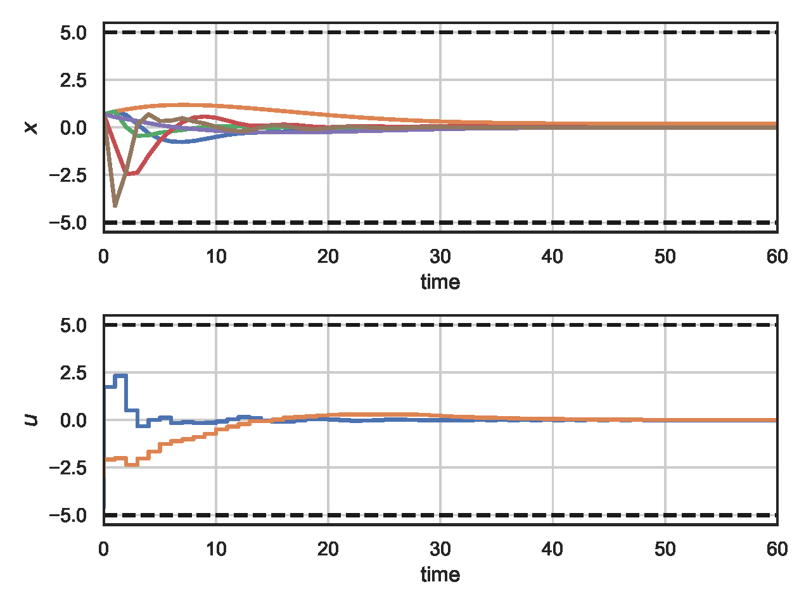
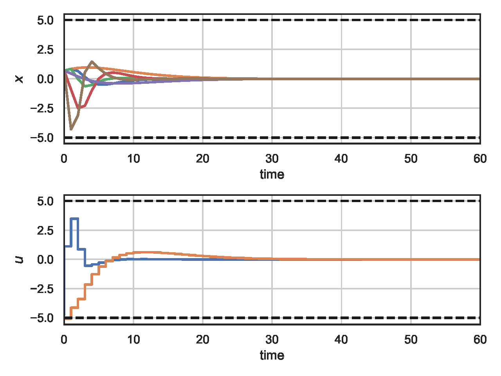
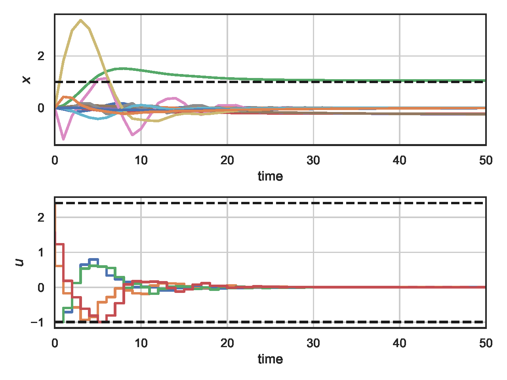
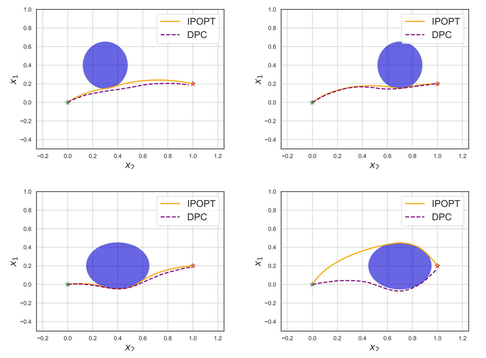
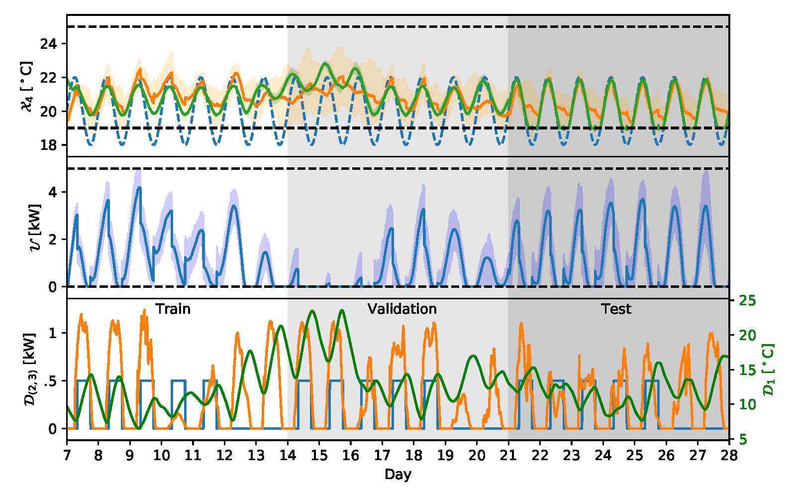
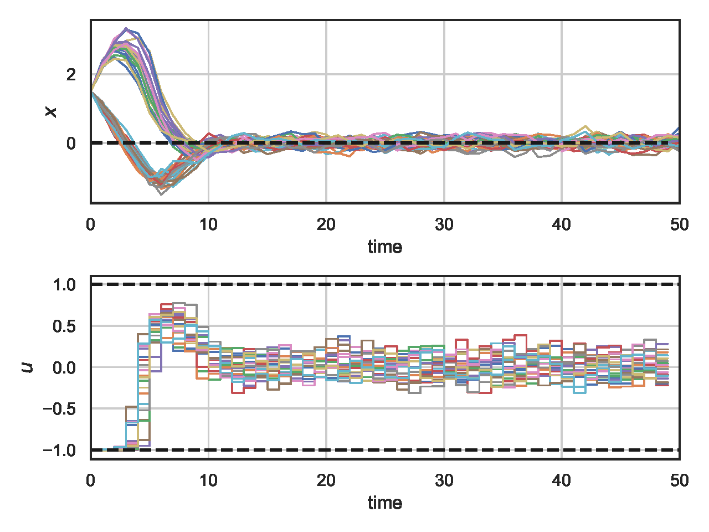
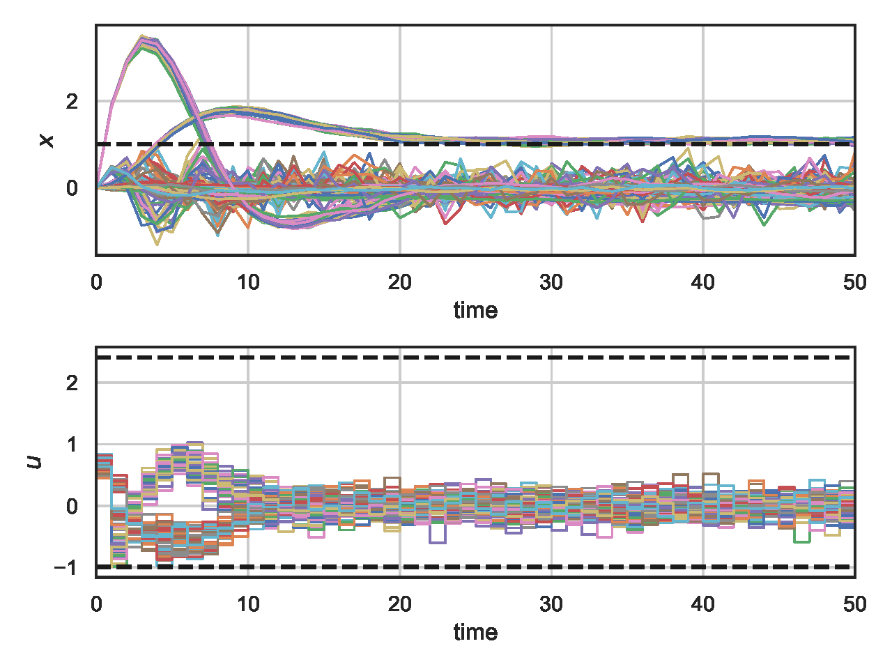
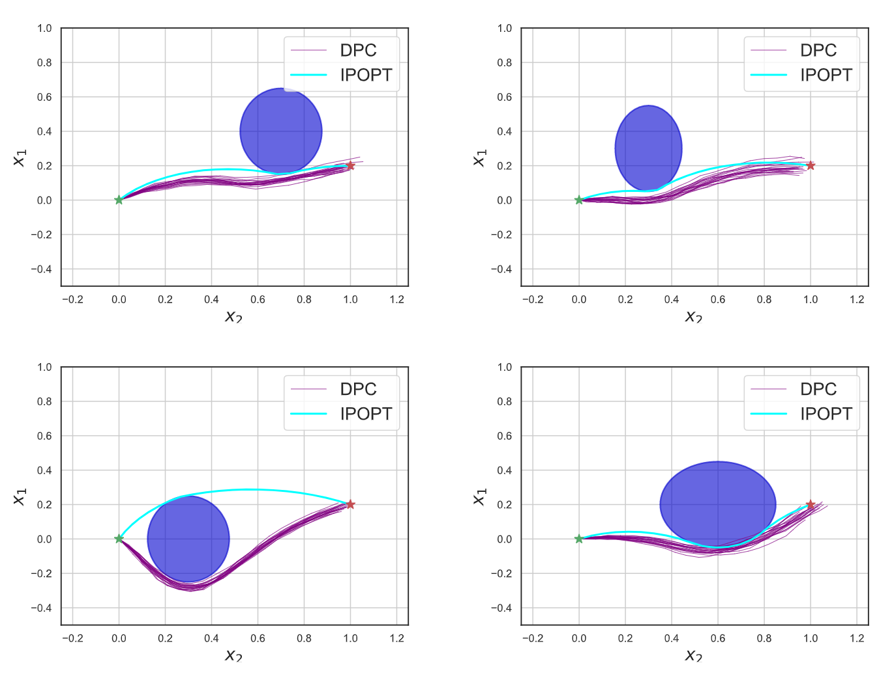

# Differentiable Predictive Control 
Examples of the differentiable predictive control (DPC) policy optimization algorithm presented in the paper "Learning Constrained Adaptive Differentiable Predictive Control Policies With Guarantees"
https://arxiv.org/abs/2004.11184

DPC combines the principles of model predictive control, reinforcement learning, and differentiable programming to offer a systematic way for offline unsupervised model-based policy optimization with goal-parametrized domain-aware intrinsic rewards.


## Method and Examples

  
*Conceptual methodology. Simulation of the differentiable closed-loop system dynamics in the forward pass is followed by backward pass computing direct policy gradients for policy optimization *

  
*Structural equivalence of DPC architecture with MPC constraints.*

  
*Example 1: Closed-loop trajectories of learned stabilizing neural control policy using DPC policy optimization.*

  
*Example 1: Evolution of the closed-loop trajectories and DPC neural policy during training.*

  
*Example 1: Landscapes of the learned neural policy via DPC policy optimization algorithm (right) and explicit MPC policy computed using parametric programming solver (left).*

  
*Example 2: Closed-loop control trajectories for the PVTOL aircraft model controlled by DPC neural policy.*

  
*Example 2: Closed-loop control trajectories for the PVTOL aircraft model controlled by approximate MPC neural policy.*

  
*Example 3: Closed-loop reference tracking control trajectories for the quadcopter model controlled by DPC neural policy.*

  
*Example 4: Obstacle avoidance with nonlinear constraints via learned DPC neural policy compared to online IPOPT solution.*

  
*Example 5: Closed-loop trajectories of learned stabilizing neural control policy for a stochastic system using SP-DPC policy optimization.*

## Cite as

```yaml
@misc{drgona2022_DPC,
      title={Learning Constrained Adaptive Differentiable Predictive Control Policies With Guarantees}, 
      author={Jan Drgona and Aaron Tuor and Draguna Vrabie},
      year={2022},
      eprint={2004.11184},
      archivePrefix={arXiv},
      primaryClass={eess.SY}
}
```


# Stochastic Differentiable Predictive Control 
Examples of the stochastic parametric differentiable predictive control (SP-DPC) policy optimization 
algorithm presented in the paper "Learning Stochastic Parametric Differentiable Predictive Control Policies"
https://arxiv.org/abs/2203.01447

  
*Example 6: Adaptive DPC of unknown linear system subject to disturbances.*

  
*Example 7: Closed-loop reference tracking control trajectories for the stochastic quadcopter model controlled by SP-DPC neural policy.*

  
*Example 8: Stochastic obstacle avoidance with parametric nonlinear constraints via learned SP-DPC neural policy compared to online IPOPT solution.*


## Cite as

```yaml
@misc{drgona2022_SDPC,
      title={Learning Stochastic Parametric Differentiable Predictive Control Policies}, 
      author={Jan Drgona and Sayak Mukherjee and Aaron Tuor and Mahantesh Halappanavar and Draguna Vrabie},
      year={2022},
      eprint={2203.01447},
      archivePrefix={arXiv},
      primaryClass={eess.SY}
}
```

## Files for Running the DPC and SDPC Examples

### Differentiable Predictive Control Example 1 
- double_integrator_DPC.py - DPC stabilization double integrator example 
- double_integrator_eMPC.m - explicit MPC benchmark using MPT3 toolbox

### Differentiable Predictive Control Example 2
- vtol_aircraft_DPC_stabilize.py - Unsupervised DPC policy optimization for VTOL aircraft model 
- vtol_aircraft_aMPC.py - Approximate MPC supervised by online MPC solver
- pvtol_aircraft_iMPC.m - Online MPC solved in Matlab using Yalmip toolbox and quadprog solver

### Differentiable Predictive Control Example 3
- quad_3D_linearDPC.py - Reference tracking for a quadcopter model via DPC 
- CVXPY_linearMPC_quadcopter.py - Reference tracking for a quadcopter model online MPC using CVXPY and OSQP solver

### Differentiable Predictive Control Example 4
- 2D_obstacle_avoidance_DPC.py - Parametric obstacle avoidance with nonlinear constraints via DPC 
- 2D_obstacle_avoidance_csadi.py - Online obstacle avoidance using CasADi and IPOPT solver

### Differentiable Predictive Control Example 5
- DeepMPC_sysID_ctrl_sec_2_4.py - policy optimization with ground truth model 
- DeepMPC_sysID_ctrl_sec_2_5.py - adaptive policy optimization via online simultaneous system ID and policy updates 
- DeepMPC_sysID_ctrl_sec_3_7 	- computational aspects and scalability analysis

### Stohastic Differentiable Predictive Control Examples 6, 7, 8
- double_integrator_SDPC.py - stochastic DPC stabilization double integrator
- quad_3D_linearSDPC 	- Reference tracking for a quadcopter model via stochastic DPC 
- 2D_obstacle_avoidance_SDPC.py - stochastic parametric obstacle avoidance with nonlinear constraints via DPC 


