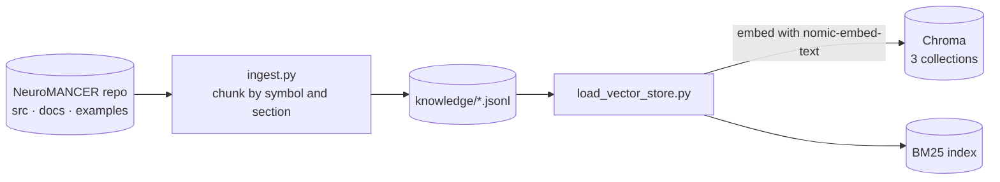
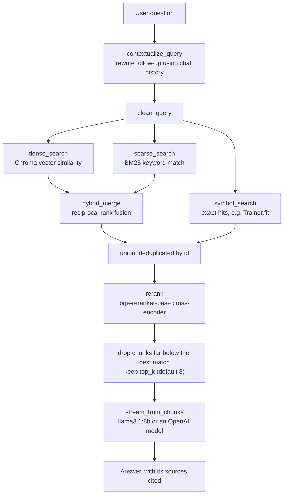

# NeuroMANCER-GPT

A retrieval-augmented assistant for [NeuroMANCER](https://github.com/pnnl/neuromancer).
It answers questions about the library's API, documentation, and examples, grounded in
this repository — it chunks the source, docs, and notebooks, embeds them into a local
search index, and serves a chat UI over the result. It runs entirely on your machine, or
against an OpenAI-compatible API if you would rather not download a local model.

## Table of Contents
1. [Prerequisites](#prerequisites)
2. [Choose Your Install](#choose-your-install)
3. [Installation](#installation)
4. [Running the Assistant](#running-the-assistant)
5. [Configuration](#configuration)
6. [Troubleshooting](#troubleshooting)
7. [How It Works](#how-it-works)

---

## Prerequisites

### 1. Ollama (required)

[**Install Ollama**](https://ollama.com/download).

```bash
brew install ollama                              # macOS
curl -fsSL https://ollama.com/install.sh | sh    # Linux
winget install Ollama.Ollama                     # Windows (PowerShell)
```

Check it is on your PATH before continuing:

```bash
ollama --version
```

Ollama is required in **both** installation modes, including the API mode below. Query
embeddings always run locally through Ollama; only the *answers* can be delegated to an
API. The setup and run scripts start `ollama serve` for you if it is not already running.

### 2. Everything Else

| | |
|---|---|
| Python | 3.11 or newer (NeuroMANCER itself supports 3.9+, but the assistant needs 3.11+) |
| Shell | bash — on Windows use **WSL** or **Git Bash**; the scripts do not run in PowerShell |
| RAM | 8 GB minimum, 16 GB recommended |
| Disk | ~6.5 GB local mode, ~1.5 GB API mode (models plus the search index) |
| GPU | optional; speeds up local models but is not required |
| Network | first setup only, to download models |

---

## Choose Your Install

The only meaningful difference is the 4.9 GB answering model.

| | **Local** (default) | **API** (`--api`) |
|---|---|---|
| Ollama runtime | required | **required** (embeddings) |
| `nomic-embed-text` — embeddings | 274 MB | 274 MB |
| `bge-reranker-base` — reranking | 1.1 GB | 1.1 GB |
| `llama3.1:8b` — answers | **4.9 GB** | **skipped** |
| API key | not needed | entered in the app sidebar |
| **First-run download** | **~6.3 GB** | **~1.4 GB** |
| Running cost | free, offline after setup | per-token, needs network |

Pick **Local** if you want everything on your machine and don't mind the download.
Pick **API** if you already have an OpenAI key and would rather not store a 5 GB model.

---

## Installation

```bash
git clone https://github.com/pnnl/neuromancer.git
cd neuromancer

# activate whichever environment you keep neuromancer in, e.g.
conda activate neuromancer
```

Then run the setup for your chosen mode:

```bash
# Local — everything on this machine, ~6.3 GB
bash assistant/scripts/setup.sh
```

```bash
# API — no local answering model, ~1.4 GB
bash assistant/scripts/setup.sh --api
```

`setup.sh` installs dependencies, downloads the models for your mode, chunks the
repository, and builds the search index. It prints what it is about to download before it
starts, so you can back out. The first run is the slow one — most of the time goes on
downloading models and embedding chunks.

In API mode there is nothing else to set up: start the app, pick **OpenAI** in the
sidebar, and paste your key into the field below it.

---

## Running the Assistant

```bash
bash assistant/scripts/run.sh
```

This starts Ollama if needed and serves the UI at <http://localhost:8501> — open that
address in your browser. Set `PORT` to use a different port.

Ask questions in plain language — "how do I define a constraint?", "what does
`Trainer.fit` do?", "show me a DPC example". Each answer cites the files it drew from, so
you can jump to the source.

Re-run `setup.sh` whenever the NeuroMANCER source, docs, or examples change — it re-chunks
and rebuilds the index from scratch.

---

## Configuration

All configuration is via environment variables; defaults live in `app/settings.py`.

| Variable | Default | Purpose |
|---|---|---|
| `NEUROMANCER_LLM_PROVIDER` | `ollama` | `ollama` or `openai` |
| `NEUROMANCER_LLM_MODEL` | `llama3.1:8b` / `gpt-5.6` | Answering model |
| `NEUROMANCER_OPENAI_MODELS` | `gpt-5.6` | Comma-separated model list offered in the sidebar |
| `OPENAI_API_KEY` | — | Optional; pre-fills the sidebar key field |
| `OPENAI_BASE_URL` | `https://api.openai.com/v1` | Point at any OpenAI-compatible endpoint (Azure, vLLM, OpenRouter, LM Studio) |
| `NEUROMANCER_TOP_K` | `8` | Chunks passed to the model as context |
| `OLLAMA_URL` | `http://localhost:11434` | Where Ollama is listening |
| `NEUROMANCER_ROOT` | this checkout | Repository to index |
| `PORT` | `8501` | Streamlit port |

Provider, model, and API key can all be set at runtime from the app's sidebar; none of
these variables are required.

---

## Troubleshooting

**`ollama is not installed or not on PATH`** — install it with the command for your OS
in [Prerequisites](#1-ollama-required). The assistant cannot run without it, even in API
mode.

**`The assistant needs Python 3.11+`** — your active environment is older. NeuroMANCER
supports 3.9+, so this may be deliberate; create a separate environment for the assistant:

```bash
conda create -n neuromancer-gpt python=3.11 -y && conda activate neuromancer-gpt
```

**`OpenAI API key missing`** — the sidebar is set to OpenAI but the key field is empty.
Paste your key into it. Switching the provider clears the chat, so do it before asking
anything you want to keep.

**`Search index is missing`** or **`BM25 index unavailable`** — `run.sh` ran before
`setup.sh` finished, or the index is stale. Re-run `bash assistant/scripts/setup.sh`.

**Answers are slow on the local model** — `llama3.1:8b` needs roughly 8 GB of RAM. Either
use `--api` mode, or set `NEUROMANCER_LLM_MODEL` to something smaller such as
`llama3.2:3b`.

---

## How It Works

The assistant works in two phases: it indexes the repository once during setup, then
searches that index on every question.

### Indexing, once, during `setup.sh`



Chunks follow structure rather than a fixed character count: Python is split per class
and function, documentation per heading, notebooks so each markdown cell stays with the
code it explains. Every chunk is then embedded and written to two indexes over the same
text — a vector store for meaning, a keyword index for exact terms.

This creates `knowledge/` and `chroma_store/` — roughly 1,900 chunks and 34 MB for a
current checkout, though repeated rebuilds grow the store since SQLite does not reclaim
space. Both are generated and untracked; delete them and the next `setup.sh` rebuilds
them.

### Answering, on every question



Search is hybrid because each strategy fails differently: vector similarity handles
paraphrase but blurs rare identifiers, keyword search catches those, and symbol lookup
covers an API name typed verbatim. The results are fused, reranked, and trimmed — chunks
scoring far below the best match are dropped rather than padded out to a fixed count, so
a narrow question returns few sources instead of several irrelevant ones.

