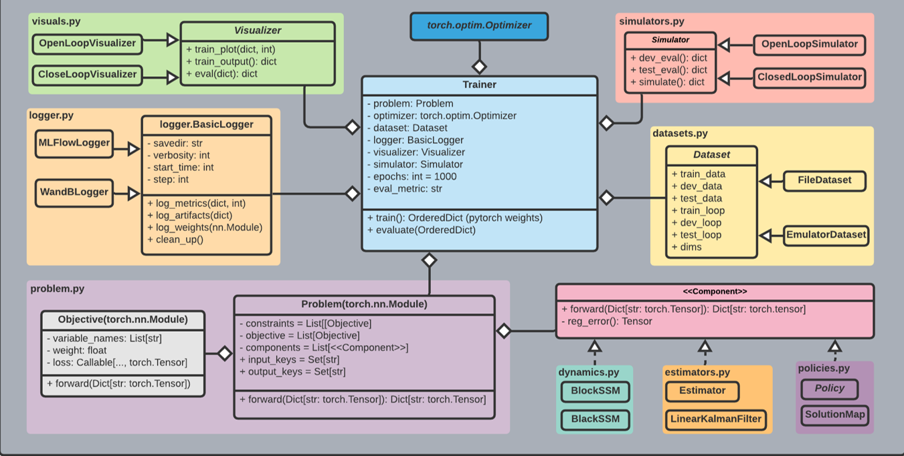

.. SLiM documentation master file, created by
   sphinx-quickstart on Sat Nov  7 06:40:51 2020.
   You can adapt this file completely to your liking, but it should at least
   contain the root `toctree` directive.
.. _Aaron Tuor: http://sw.cs.wwu.edu/~tuora/aarontuor/

NeuroMANCER
============================

.. toctree::
   :maxdepth: 2
   :caption: Modules:

   dynamics.rst
   activations.rst
   blocks.rst
   bounds.rst
   dataset.rst
   estimators.rst
   loggers.rst
   operators.rst
   plot.rst
   problem.rst
   rnn.rst
   simulators.rst
   trainer.rst
   visuals.rst
   arg.rst
   callbacks.rst
   component.rst
   constraint.rst
   gradients.rst
   bounds.rst
   gnn.rst
   graph_dynamics.rst
   integrators.rst
   interpolation.rst
   loss.rst
   maps.rst
   ode.rst
   pwa_maps.rst
   solvers.rst

Authors: Aaron Tuor, Jan Drgona, Mia Skomski, Stefan Dernbach, James Koch, Zhao Chen, Draguna Vrabie

