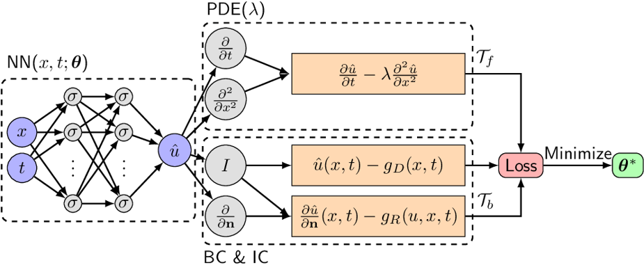

# Scientific Machine Learning for PDEs in Neuromancer

This directory contains interactive examples that can serve as a step-by-step tutorial 
showcasing SciML capabilities for PDEs in Neuromancer.

Physics-informed neural networks (PINNs) examples:  
+  Part 1: Diffusion Equation
+  Part 2: Burgers' Equation
+  Part 3: Burgers' Equation w/ Parameter Estimation (Inverse Problem)
+  Part 4: Laplace's Equation (steady-state)
+  Part 5: Damped Pendulum (stacked PINN)
+  Part 6: Navier-Stokes equation (lid-driven cavity flow, steady-state, KAN)

## Physics-informed neural networks

[Physics-informed neural networks (PINNs)](https://en.wikipedia.org/wiki/Physics-informed_neural_networks)
is a method for approximate solutions to differential equations.
By exploiting prior knowledge in the form of PDE equations, 
PINNs overcome the low data availability of some systems.
The prior knowledge of PDE physical laws is used in the training 
of neural networks as a regularization that limits 
the space of admissible solutions of the function approximation.

### PINNs architecture 
  

The neural network (NN) acts as a function approximator, mapping the spatio-temporal
coordinates $(x, t)$ onto the solution $\hat{u}$: 
$\hat{u} = NN_{\theta}(x,t)$.

The NN approximation must satisfy the PDE equations $NN_{\theta}(x,t) \approx u(x,t)$. 
Thus in PINNs we define the physics-informed layers $f_{\texttt{PINN}}$ 
that represent the known PDE equations. Then can obtain the derivatives of the NN, e.g.,
$\frac{\partial NN_{\theta}}{\partial t},\frac{\partial^2 NN_{\theta}}{\partial x^2}$ 
using [Automatic Diferentiation](https://en.wikipedia.org/wiki/Automatic_differentiation). 

### PINNs dataset 
The training dataset contains [collocation points (CP)](https://en.wikipedia.org/wiki/Collocation_method) 
of the spatio-temporal domain $(x, t)$, and samples of the [initial conditions (IC)](https://en.wikipedia.org/wiki/Initial_condition), 
and [boundary conditions (BC)](https://en.wikipedia.org/wiki/Boundary_value_problem).

### PINNs loss function

The PINNs loss function is composed of multiple terms.

**PDE Collocation Points Loss:**  
The PINN $f_{\texttt{PINN}}$ is evaluated over given number ($N_f$) 
of collocation points (CP) to minimize the PDE residuals 
in the following loss function term:  
$$\ell_{f} = \frac{1}{N_f} \sum_{i=1}^{N_f} |f_{\texttt{PINN}}(t_f^i,x_f^i)|^2$$

If $f_{\texttt{PINN}}\rightarrow 0$ then the PINN will be respecting 
the physical law.

**PDE Initial and Boundary Conditions Loss:**

We select $N_u$ points from the BC and IC and used them in the following supervised learning loss term:

$$ \ell_{u} = \frac{1}{N_u} \sum_{i=1}^{N_u} |u(t_{u}^i,x_u^i)-NN_{\theta}(t_{u}^i,x_u^i)|^2 $$

**Bound the PINN output in the PDE solution domain:**  
Sometimes we expect the outputs of the neural net 
to be bounded in the PDE solution domain $NN_{\theta}(x,t) \in [u_{min}, u_{max}]$, 
thus we impose the following inequality constraints via additional penalties:

$$\ell_{y} = \frac{1}{N_f} \sum_{i=1}^{N_f} \Big(|\texttt{RELU}(NN_{\theta}(t_{f}^i,x_f^i) - u_{max})|^2 + |\texttt{RELU}(-NN_{\theta}(t_{f}^i,x_f^i) + u_{min})|^2 \Big)$$

**Total Loss:**  
Then the total loss is just a sum of PDE residuals over CP 
and supervised learning residuals over IC and BC.
$$\ell_{\text{PINN}}=\ell_{f}+\ell_{u} +\ell_{y}$$

## Stacked (Multi-Fidelity) Physics-Informed Neural Networks
Stacked physics-informed neural networks represent a novel approach to enhance the training efficiency and accuracy of models dealing with partial differential equations (PDEs). This method leverages a hierarchy of multifidelity networks, where each layer of the stack uses the output of the previous one as an input, leading to a progressive refinement of the solution [4,5]. This architecture allows for a more gradual learning process, helping overcome the difficulties typically associated with training deep networks on complex PDEs, such as those subject to fixed points and multiple local minima. Stacked PINNs are available on Neuromancer via 'blocks.MultiFidelityMLP'.

## Kolmogorov-Arnold Networks (KANs)
Based on the Kolmogorov-Arnold representation theorem, KANs offer an alternative architecture: where traditional neural networks utilize fixed activation functions, KANs employ learnable activation functions on the edges of the network, replacing linear weight parameters with parametrized spline functions. This fundamental shift sometimes enhances model interpretability and improves computational efficiency and accuracy [6]. KANs are available on Neuromancer via `blocks.KANBlock`, which leverages the efficient-kan implementation of [7].

### References

[1] [Raissi, M., Perdikaris, P., & Karniadakis, G. E. (2017). Physics informed deep learning (part i): Data-driven solutions of nonlinear partial differential equations.](https://www.sciencedirect.com/science/article/abs/pii/S0021999118307125)

[2] https://en.wikipedia.org/wiki/Physics-informed_neural_networks

[3] https://i-systems.github.io/tutorial/KSME/CAE/220520/01_PINN.html

[4] [Howard, Amanda A., et al. (2023) Stacked networks improve physics-informed training: applications to neural networks and deep operator networks.](https://arxiv.org/abs/2311.06483)

[5] [Heinlein, Alexander, et al. (2023) Multifidelity domain decomposition-based physics-informed neural networks for time-dependent problems.](https://arxiv.org/abs/2401.07888)

[6] [Liu, Ziming, et al. (2024). KAN: Kolmogorov-Arnold Networks.](https://arxiv.org/abs/2404.19756)

[7] https://github.com/Blealtan/efficient-kan

