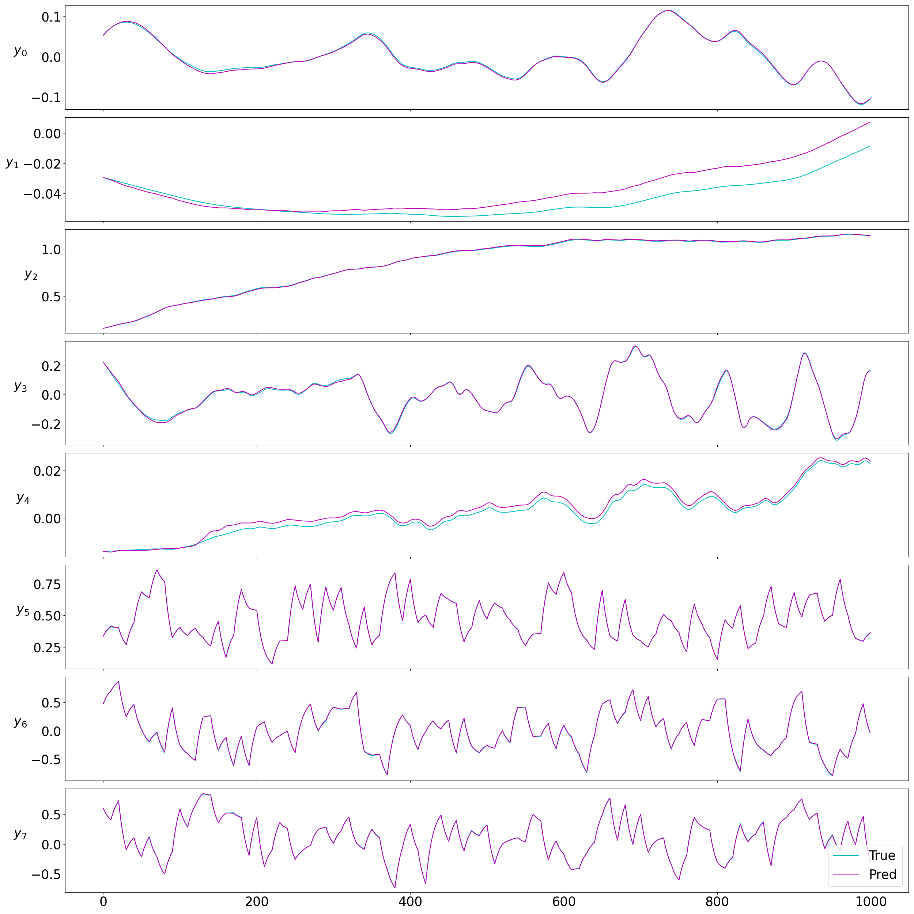
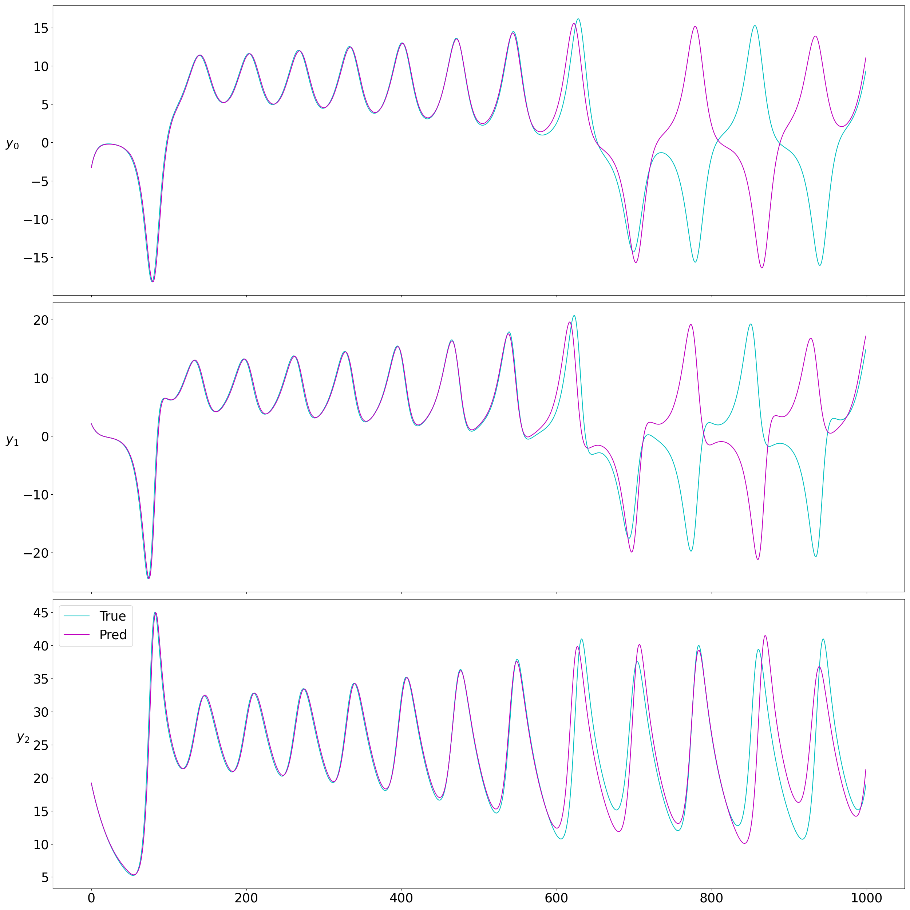
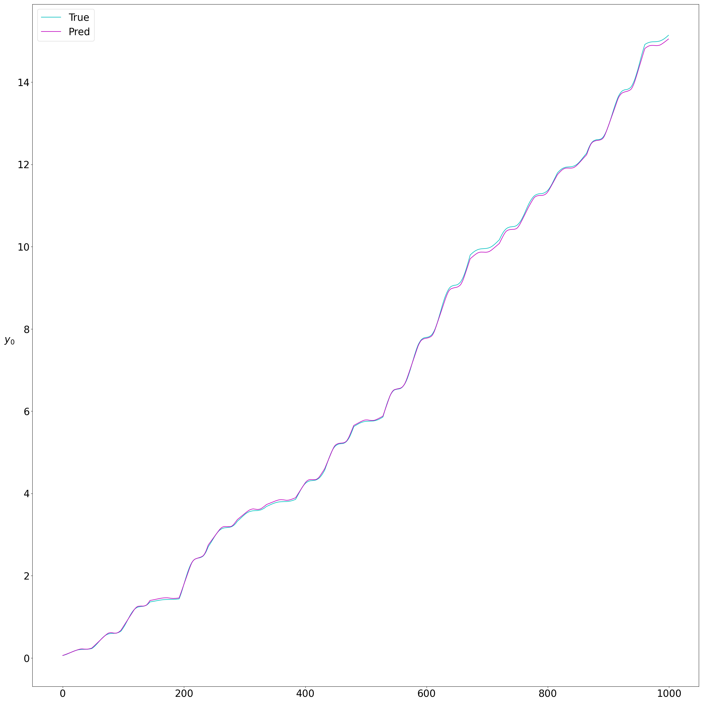
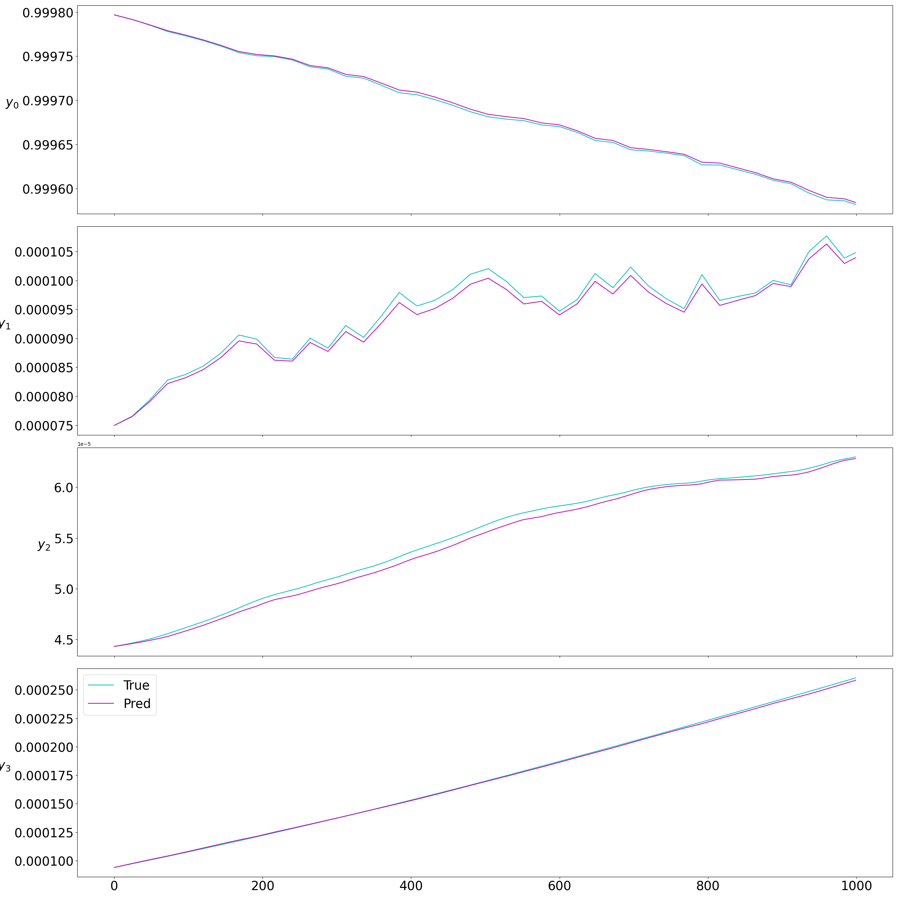
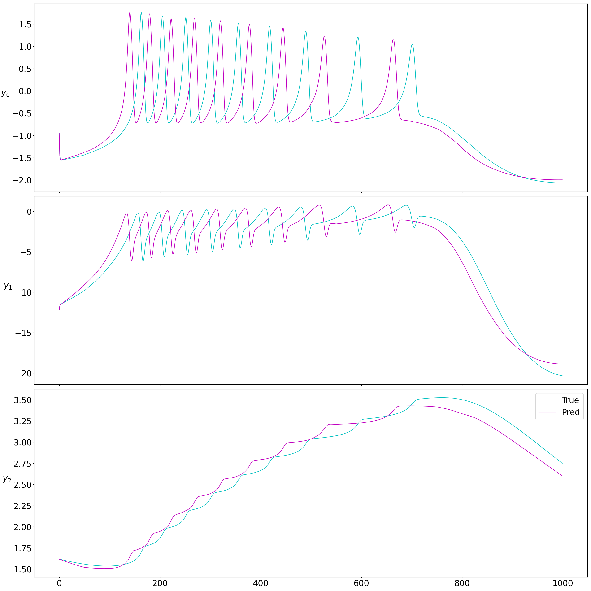

# Benchmark non-autonomous system examples NODE
For a basic problem formulation and background of NODE modeling of dynamical systems 
please refer to neuromancer/examples/system_identification/Readme.md.

The code provided in this folder benchmarks NODE dynamics learning for all the non-autonomous
systems modeled in psl/psl/nonautonomous.py. The learning objective is MSE over an n-step rollout
(alongside a single step MSE for a simple multiple shooting formulation) of the NODE model versus the ground truth psl system. Depending on the system it may be advantageous to invoke
one of several options provided in the training script: 

+ scaled_loss: Scales the MSE per individual state according to the variance of that state exhibited in the training data
  + This can be useful if you need to preserve scale for recovering dynamics but the system states operate on different scales making optimization difficult.
+ normalize: Z-score normalization for more tractable optimization
+ iterations: This controls how many stages of curriculum learning. At each stage the original n-step prediction horizon is doubled and learning rate halved
+ epochs: If you have the cycles to burn it won't hurt to train for longer. The script will save the best model according to the selection criterion
+ eval_metric: By default the script uses the eval_mse which is the Mean squared error over the ten random 1000 step sequences in the test set
  + This could be changed to eval_tmse which is a truncated variant of the MSE useful for modeling chaotic systems.
+ nstep: Some systems are easier to optimize with longer or shorter initial prediction horizons. 
  + Note here that the larger nstep and the larger iterations will use a larger amount of training data
+ q coefficients: These are coefficients on the relative influence of various loss terms. By default we use equal values for nstep MSE and single step MSE. Other loss functions are available by changing the q value to be non-zero.

The NODE model default settings in the training script are: 
+ 4 layer neural network with 128 nodes per layer modeling the right hand side of the ODE
+ Fully observable state space
+ Euler integration method
+ Time step inferred from PSL system

## Benchmark metrics
Here are results from running the benchmark examples below. 
MSE and MAE are calculated in native units to the system so aren't
comparable across systems. For an intuitive idea of how a simple black 
box NODE should perform on these benchmarks please refer to the plots and r^2 values.


| System                     | MAE   | MSE   | $r^2$ |
|----------------------------|-------|-------|-------|
| DuffingControl             | 0.014 | 0.017 | 0.993 |
| LorenzControl              | 2.980 | 6.546 | 0.246 |
| IverSimple                 | 0.004 | 0.004 | 0.920 |
| Iver_dyn_simplified        | 2.863 | 3.315 | -57.0 |
| Iver_dyn_simplified_output | 0.042 | 0.052 | 0.773 |
| CSTR                       | 0.026 | 0.035 | 0.999 |
| TwoTank                    | 0.011 | 0.014 | 0.986 |
| InvPendulum                | 0.103 | 0.129 | 0.816 |
| SwingEquation              | 0.000 | 0.000 | 0.897 |
| Tank                       | 0.034 | 0.042 | 1.000 |
| ThomasAttractorControl     | 0.025 | 0.038 | 0.998 |
| SEIR_population            | 0.000 | 0.000 | 0.993 |
| VanderpolControl           | 0.276 | 0.365 | 0.930 |
| HindmarshRose              | 0.785 | 0.982 | 0.614 |

## Files
+ train.py: Training script for all psl non-autonomous systems for NODE implementation


## Reproducing benchmark examples
Below are the commands to run benchmark examples and the resulting plot of performance 
for a rollout of the system from a random initial condition and sequence of control actions.

### DuffingControl
```bash
python train.py -model node -system DuffingControl -q_mse_xnstep 2 -q_mse_xstep .5 -epochs 250 -iterations 6
```


### TwoTank
```bash
python train.py -system TwoTank -nsim 1000 -epochs 1000 -iterations 1 -nsteps 8 -normalize
```


### CSTR
```bash
python train.py -system CSTR -nsim 1000 -epochs 100 -nsteps 16 -normalize -iterations 1
```


### IverSimple
```bash
python train.py -system IverSimple -nsim 1000 -epochs 500 -scaled_loss -iterations 5
```


### Iver_dyn_simplified_output
```bash
python python train.py -system Iver_dyn_simplified_output
```


### Iver_dyn_simplified
```bash
python python train.py -system Iver_dyn_simplified
```


### LorenzControl
```bash
python train.py -system LorenzControl -iterations 5 -epochs 1000 -q_mse_xnstep 2 -q_mse_xstep 0
```


### InvPendulum
```bash
python train.py -system InvPendulum -nsim 500 -epochs 50 -nsteps 16 -scaled_loss
```


### SwingEquation
```bash
python train.py -system SwingEquation -nsim 1000 -epochs 10 -nsteps 8 -normalize -iterations 1
```


### Tank
```bash
python train.py -system Tank -nsteps 16 -epochs 50
```


### ThomasAttractorControl
```bash
python train.py -system ThomasAttractorControl -logdir tom -epochs 50 -iterations 5
```


### SEIR_population
```bash
python train.py -system SEIR_population -nsteps 8 -epochs 100 -normalize -iterations 1
```


### VanDerPolControl
```bash
python train.py -system VanDerPolControl -nsteps 8 -epochs 100 -normalize -iterations 1
```


### HindmarshRose
```bash
python train.py -system HindmarshRose -nsteps 8 -epochs 500 -normalize -iterations 1
```



