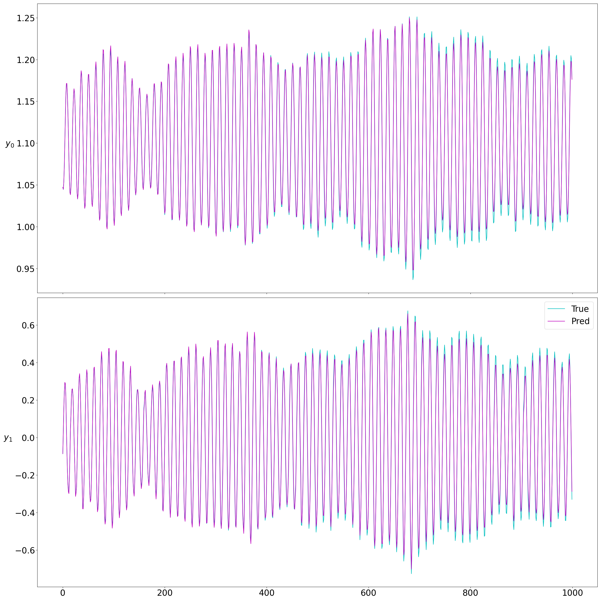
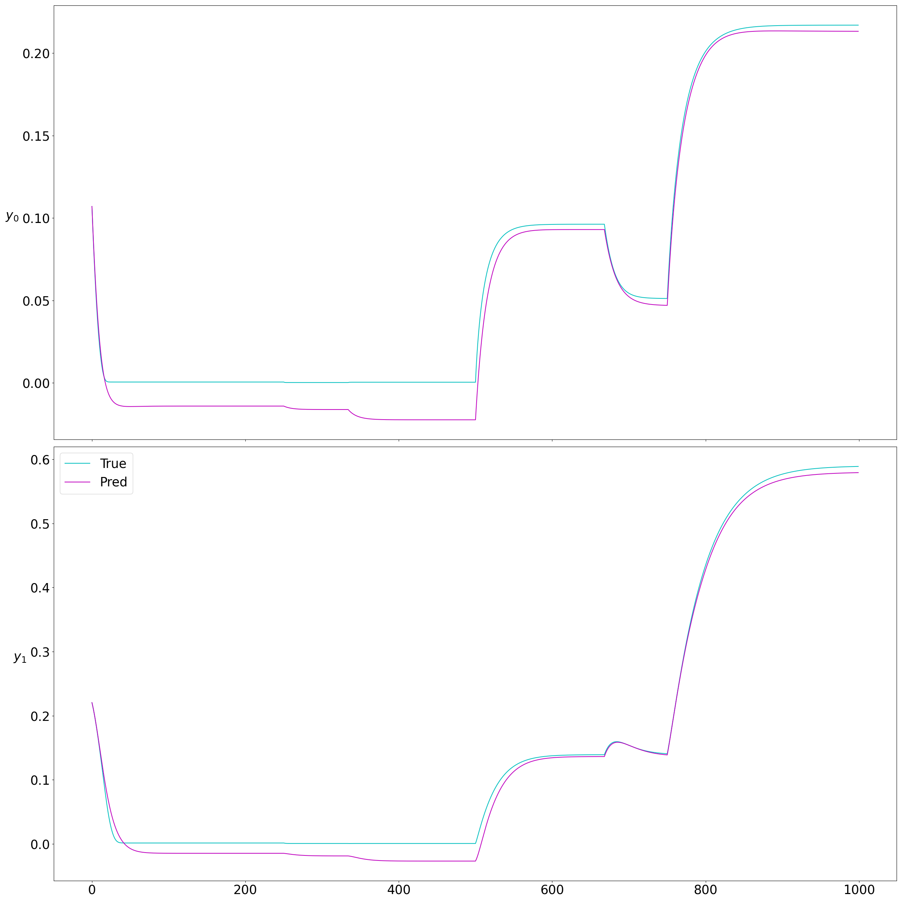
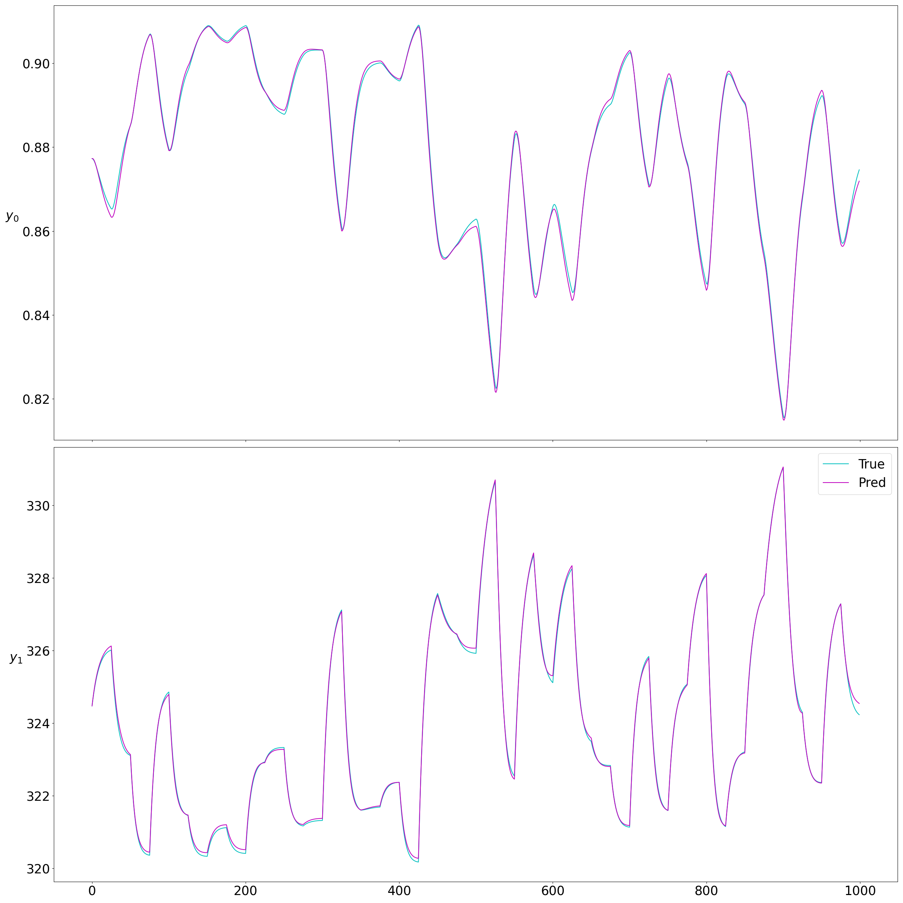
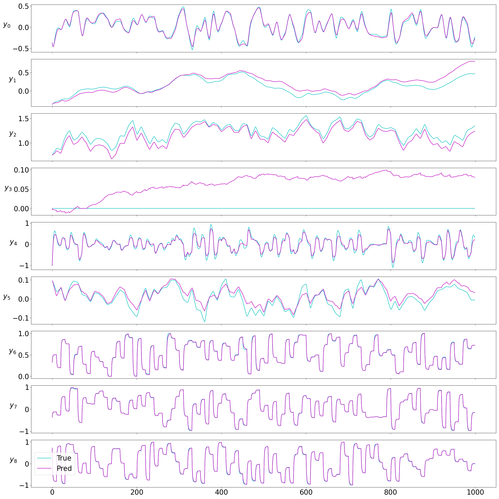
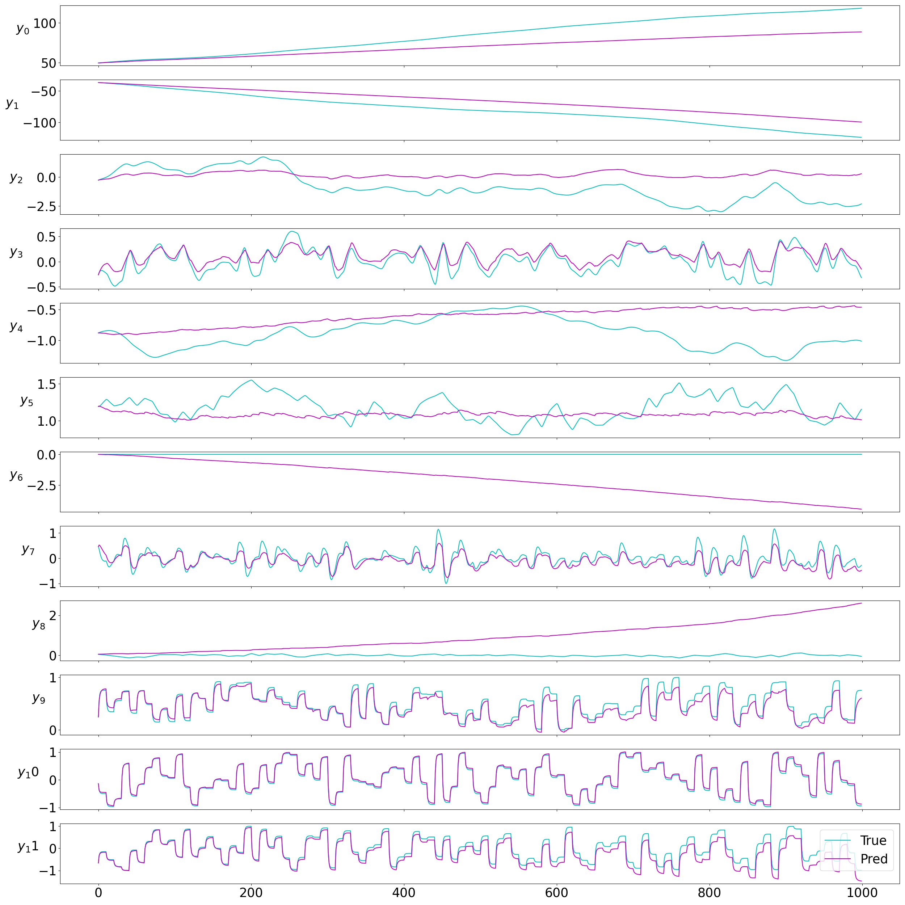
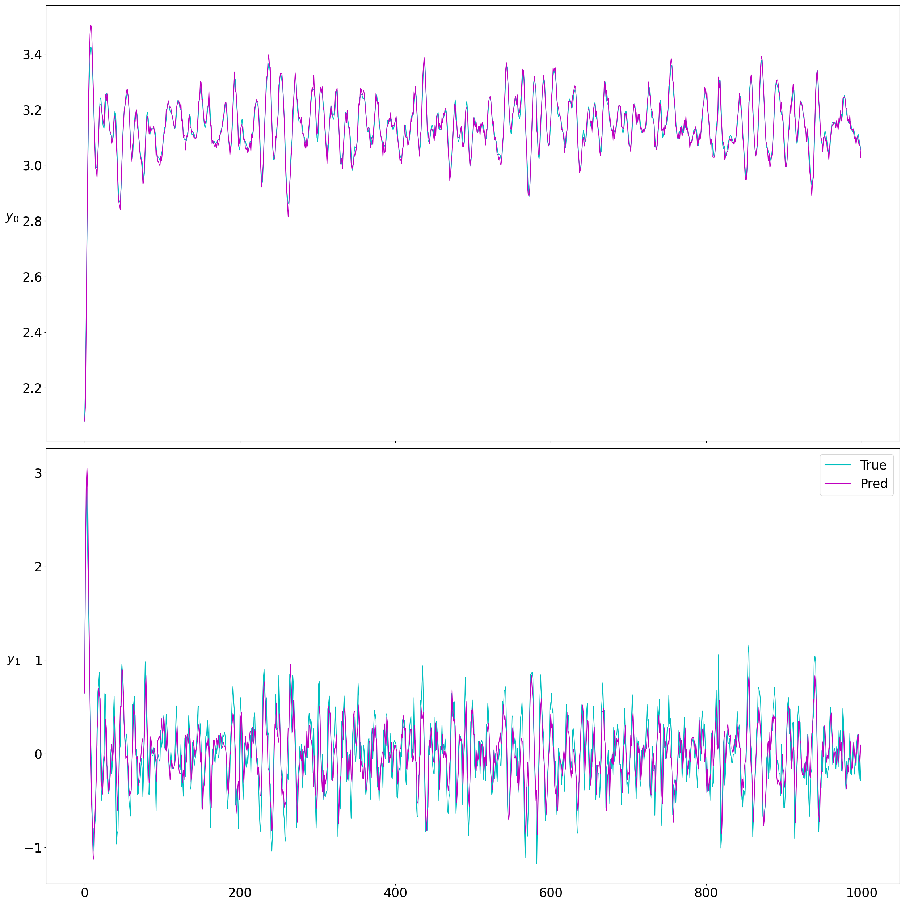
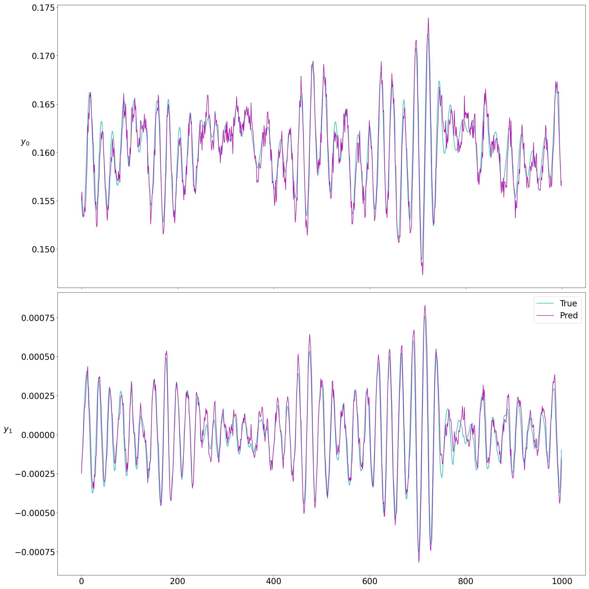
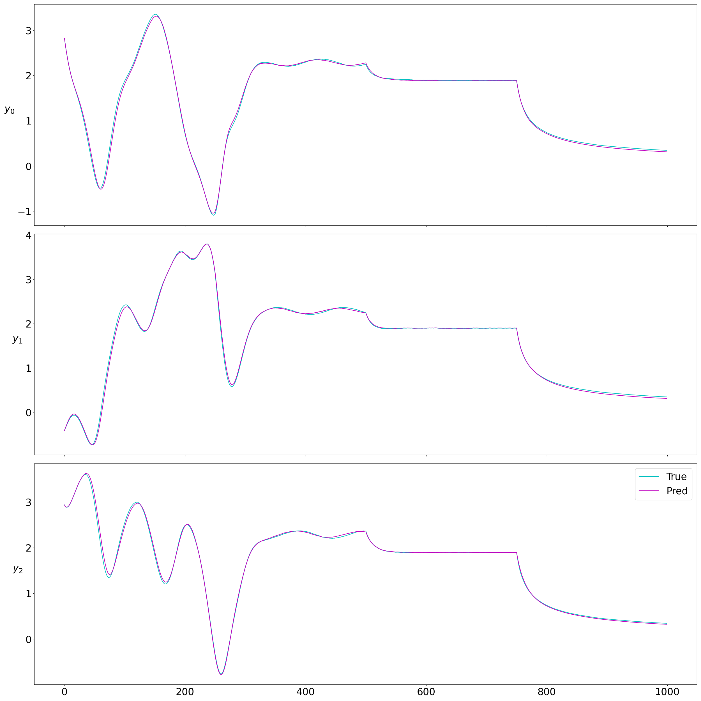
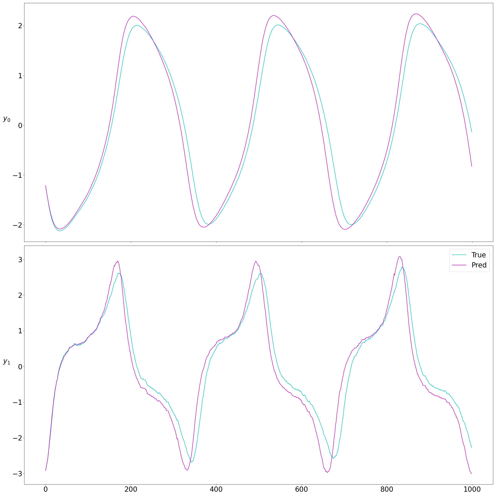

# koopman_neuromancer_integration

Repository for integration of koopman operator modeling and control into core neuromancer. 
## Benchmark non-autonomous system examples NODE
| System                     | MAE   | MSE   | $r^2$ |
|----------------------------|-------|-------|-------|
| DuffingControl             | 0.014 | 0.017 | 0.993 |
| LorenzControl              | 2.980 | 6.546 | 0.246 |
| IverSimple                 | 0.004 | 0.004 | 0.920 |
| Iver_dyn_simplified        | 2.863 | 3.315 | -57.0 |
| Iver_dyn_simplified_output | 0.042 | 0.052 | 0.773 |
| CSTR                       | 0.026 | 0.035 | 0.999 |
| TwoTank                    | 0.011 | 0.014 | 0.986 |
| InvPendulum                | 0.103 | 0.129 | 0.816 |
| SwingEquation              | 0.000 | 0.000 | 0.897 |
| Tank                       | 0.034 | 0.042 | 1.000 |
| ThomasAttractorControl     | 0.025 | 0.038 | 0.998 |
| SEIR_population            | 0.000 | 0.000 | 0.993 |
| VanderpolControl           | 0.276 | 0.365 | 0.930 |
| HindmarshRose              | 0.785 | 0.982 | 0.614 |

### DuffingControl
```bash
python train.py -model node -system DuffingControl -q_mse_xnstep 2 -q_mse_xstep .5 -epochs 250 -iterations 6
```


### TwoTank
```bash
python train.py -system TwoTank -model node -nsim 1000 -epochs 1000 -iterations 1 -nsteps 8 -normalize
```


### CSTR
```bash
python train.py -system CSTR -model node -nsim 1000 -epochs 100 -nsteps 16 -normalize -iterations 1
```


### IverSimple
```bash
python train.py -system IverSimple -model node -nsim 1000 -epochs 500 -scaled_loss -iterations 5
```


### Iver_dyn_simplified_output
```bash
python python train.py -system Iver_dyn_simplified_output
```



### Iver_dyn_simplified
```bash
python python train.py -system Iver_dyn_simplified
```


### LorenzControl
```bash
python train.py -system LorenzControl -iterations 5 -epochs 1000 -model node -q_mse_xnstep 2 -q_mse_xstep 0
```


### InvPendulum
```bash
python train.py -system InvPendulum -nsim 500 -epochs 50  -stepper euler -nsteps 16 -scaled_loss
```


### SwingEquation
```bash
python train.py -system SwingEquation -nsim 1000 -epochs 10  -stepper euler -nsteps 8 -normalize -iterations 1
```


### Tank
```bash
python train.py -system Tank -nsteps 16 -epochs 50
```


### ThomasAttractorControl
```bash
python train.py -system ThomasAttractorControl -logdir tom -epochs 50 -iterations 5
```


### SEIR_population
```bash
python train.py -system SEIR_population -nsteps 8 -epochs 100 -normalize -iterations 1
```


### VanDerPolControl
```bash
python train.py -system VanDerPolControl -nsteps 8 -epochs 100 -normalize -iterations 1
```


### HindmarshRose
```bash
python train.py -system HindmarshRose -nsteps 8 -epochs 500 -normalize -iterations 1
```


