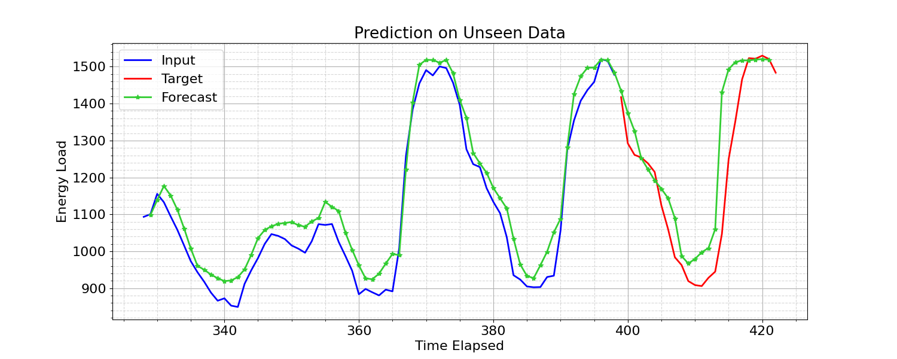
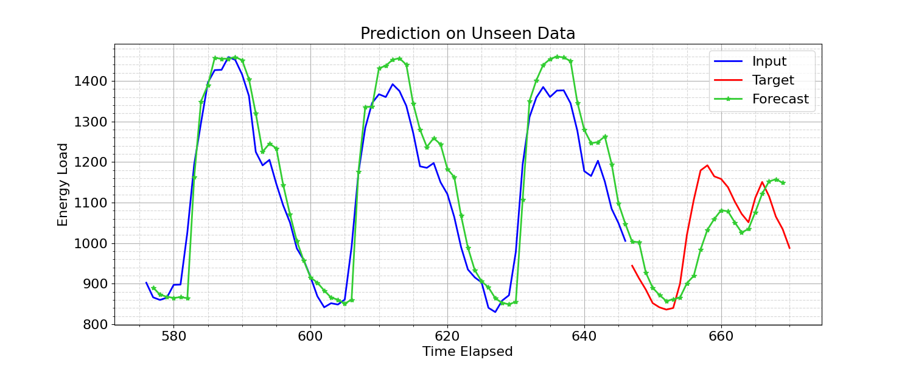
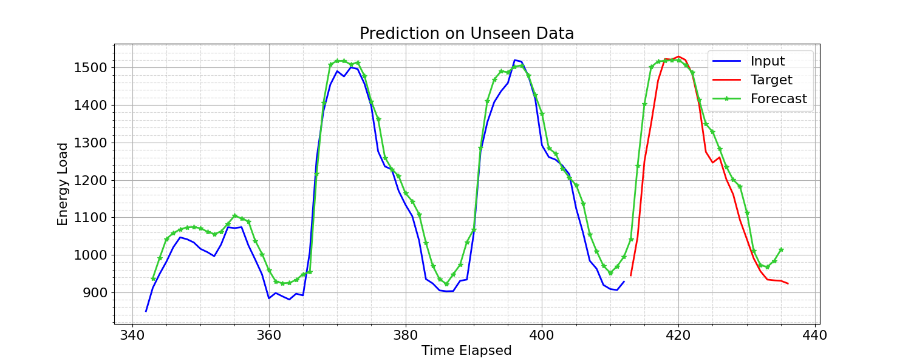

# Domain Examples in Neuromancer

This directory contains interactive examples that can serve as a step-by-step tutorial 
showcasing the use of Neuromancer in solving various domain problems.

## Data-driven Dynamical Systems Modeling Examples

+  Learning Building Thermal Dynamics using Neural ODEs 

+  Learning Building Thermal Dynamics using Neural State Space Models

+  Learning Swing Equation Dynamics using Neural ODEs

+  Data-driven modeling of a Resistance-Capacitance network with Neural ODEs

## Differentiable Control Examples

+  Learning to Control Indoor Air Temperature in Buildings

+  Learning to Control Pumped-storage Hyrdoelectricity System

+  Learning to Control a Building With Safe Reinforcement Learning and Differentiable Predictive Control

## Electricity Load Modelling and Forecasting

+  Energy Load Forecasting for the Air Handling System of an Office Building with MLP and CNN models

+   Energy Load Forecasting for Building with Transformers Model

These tutorials display an easy-to-follow notebook for novice machine learning (ML) and deep learning (DL) practitioners within the  building energy space. More specifically, this tutorial demonstrates the use of time-series modelling and forecasting using the Short-Term Electricity Load Forecasting (Panama case study) dataset and introduces to users the benefits of feature engineering (data preprocessing) and the ease of large models that may otherwise seem inapproachable to beginners.

Within this introductory notebook, NeuroMANCER can now bring more advanced state-of-the-art (SOTA) models into the existing library, increasing the breadth of models available to end-users as well as broadening prospective new users.

Specifically, the Transformer model is incorporated into the blocks.py module, allowing for end-users to load an out-of-the-box network using the blocks interface on NeuroMANCER.

Complimentary to the Energy Load Forecasting Notebook using a multi-layered perceptron (MLP), this notebook offers a tutorial for energy-load modeling using historical weather features as inputs to a vanilla Transformer model. This tutorial also allows for the capability of forecasting future timesteps when future weather forecasts are inaccessible or too uncertain.

While this notebook does not display the use of forecasting future timesteps without weather inputs, after training the model displayed in the notebook for 175 epochs, one can achieve relatively good results for forecasting future timesteps:

  

  

  
