# Learning to Solve Constrained Optimization Problems
    
## Differentiable Parametric Programming (DPP) 

Learning Solutions to Constrained Optimization Problems
is a set of methods that use machine learning to learn the  
solutions (explicit solvers) to optimization problems. 
Constrained optimization problems where the solution x depends on the varying problem parameters ξ are
called [parametric programming problems](https://en.wikipedia.org/wiki/Parametric_programming).
Neuromancer allows you to formulate and solve a broad class of parametric optimization problems 
via the [Differentiable Programming (DP)](https://en.wikipedia.org/wiki/Differentiable_programming) paradigm.
Hence, we call the approach Differentiable Programming Programming (DPP).
Specifically, Neuromancer allows you to use 
automatic differentiation (AD) in PyTorch to compute the sensitivities of 
such constrained optimization problems w.r.t. their parameters. 
This allows you to leverage gradient-based optimizers (e.g., stochastic gradient descent)
to obtain approximate solutions to constrained parametric programming problems via for semi-supervised offline learning. 
The main advantage of this offline DPP-based solution compared to classical optimization solvers (e.g., IPOPT) 
is faster online evaluation, often obtaining orders of magnitude speedups.

  
*Visualisation of parametric sensitivity of nonlinear programming problem (NLP)
 solution of which changes with varying objective and constraints parameters. 
Green star represents solution obtained via classical online solver (IPOPT), 
where red star shows solution obtained via offline learning using DPP approach (Neuromancer).*

###  Imitation Learning vs DPP

Recent years have seen a rich literature
of deep learning (DL) models for solving the constrained optimization problems on real-world tasks such
as power grid, traffic, or wireless system optimization. Earlier attempts simply adopt imitation learning
(i.e., supervised learning) to train function approximators via a minimization of the prediction error using
labeled data of pre-computed solutions using iterative solvers (i.e. IPOPT). Unfortunately, these models can
hardly perform well on unseen data as the outputs are not trained to satisfy physical constraints, leading to
infeasible solutions.
To address the feasibility issues, existing methods have been imposing constraints on the output space
of deep learning models for a subsequent differentiation using AD tools. These differentiable programming-based 
methods, also called end-to-end learning with constraints or learning to optimize, 
directly consider the original objectives and constraints in
the DL training process without the need of expert labeled data. 
The following figure conceptually demonstrated the difference between supervised imitation learning 
and unsupervised Differentiable Parametric Programming (DPP) which solution is obtained by 
differentiating the objectives and constraints of the parametric optimization  problem.

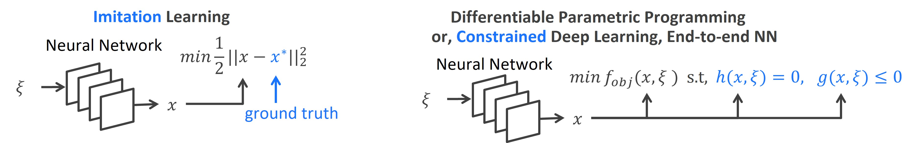  
*Imitation learning VS end-to-end learning using Differentiable Parametric Programming.*

### DPP Problem Formulation
A generic formulation of the DPP is given
in the form of a parametric constrained optimization problem:
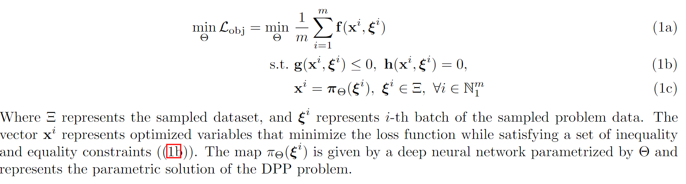


### Differentiable Loss Functions of Parametric Optimization Problems

There are several ways in which we can enforce the constraints satisfaction
while learning the solution π_Θ(ξ) of the differentiable constrained optimization problem (1). 
The simplest approach is to penalize the constraints violations by augmenting 
the loss function L (1a) with the 
[penalty loss function](https://github.com/pnnl/neuromancer/blob/master/neuromancer/loss.py#L102) 
given as:
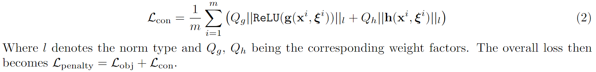  

Other approaches supported in the library include 
[barrier loss functions](https://github.com/pnnl/neuromancer/blob/master/neuromancer/loss.py#L129), or 
[augmented Lagrangian](https://github.com/pnnl/neuromancer/blob/master/neuromancer/loss.py#L203) 
type methods.


### DPP Problem Solution

The main advantage of having a differentiable objective function and constraints
in the DPP problem formulation (1) is that it allows us to use automatic differentiation to directly compute
the gradients of the parametric solution map π_Θ(ξ). In particular, by representing the problem (1) as a
computational graph and leveraging the chain rule, we can directly compute the gradients of the loss function
L w.r.t. the solution map weights Θ as follows:
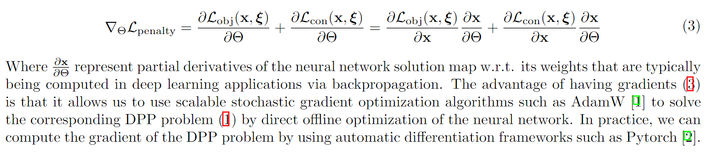


### DPP Optimization Algorithm
The gradient-based solution of the DPP problem is summarized in the following Algorithm:
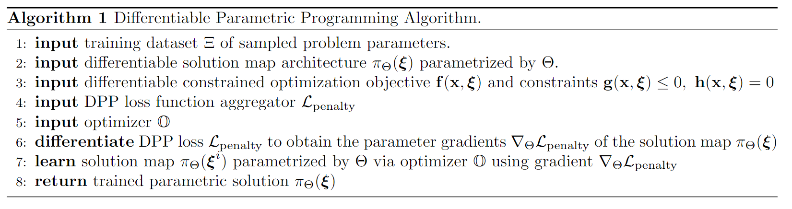


### Formulating DPP problems using Neuromancer syntax 
The following code illustrates the implementation of Differentiable Parametric
Programming in Neuromancer:
```python 
# Tutorial example for Differentiable Parametric Programming (DPP) in Neuromancer
import torch
import torch.nn as nn
import numpy as np
import neuromancer.slim as slim
from neuromancer.trainer import Trainer
from neuromancer.problem import Problem
from neuromancer.constraint import variable
from neuromancer.dataset import DictDataset
from neuromancer.loss import PenaltyLoss
from neuromancer.modules import blocks
from neuromancer.system import Node

"""
# # #  Create dataloaders sampling of problem parameters
"""
nsim = 5000  # number of datapoints: increase sample density for more robust results
# create dictionaries with sampled datapoints with uniform distribution
a_low, a_high, p_low, p_high = 0.2, 1.2, 0.5, 2.0
samples_train = {"a": torch.FloatTensor(nsim, 1).uniform_(a_low, a_high),
                 "p": torch.FloatTensor(nsim, 1).uniform_(p_low, p_high)}
samples_dev = {"a": torch.FloatTensor(nsim, 1).uniform_(a_low, a_high),
               "p": torch.FloatTensor(nsim, 1).uniform_(p_low, p_high)}
samples_test = {"a": torch.FloatTensor(nsim, 1).uniform_(a_low, a_high),
               "p": torch.FloatTensor(nsim, 1).uniform_(p_low, p_high)}
# create named dictionary datasets
train_data = DictDataset(samples_train, name='train')
dev_data = DictDataset(samples_dev, name='dev')
test_data = DictDataset(samples_test, name='test')
# create torch dataloaders for the Trainer
train_loader = torch.utils.data.DataLoader(train_data, batch_size=32, num_workers=0,
                                           collate_fn=train_data.collate_fn, shuffle=True)
dev_loader = torch.utils.data.DataLoader(dev_data, batch_size=32, num_workers=0,
                                         collate_fn=dev_data.collate_fn, shuffle=True)
test_loader = torch.utils.data.DataLoader(test_data, batch_size=32, num_workers=0,
                                         collate_fn=test_data.collate_fn, shuffle=True)

"""
# # #  Symbolic solution map architecture 
"""
# pytorch callable concatenating problem parameters 
xi = lambda a, p: torch.cat([a, p], dim=-1)
# wrap callable into symbolic representation via the Node class: features(a, p) -> xi
features = Node(xi, ['a', 'p'], ['xi'], name='features')
# define neural architecture for the trainable solution map
func = blocks.MLP(insize=2, outsize=2, linear_map=slim.maps['linear'], nonlin=nn.ReLU, hsizes=[80] * 4)
# wrap neural net into symbolic representation of the solution map via the Node class: sol_map(xi) -> x
sol_map = Node(func, ['xi'], ['x'], name='map')
    
"""
# # #  Objective and constraints formulation 
"""
# define decision variables
x = variable("x")[:, [0]]
y = variable("x")[:, [1]]
# problem parameters sampled in the dataset
p = variable('p')
a = variable('a')

# objective function
f = (1-x)**2 + a*(y-x**2)**2
obj = f.minimize(weight=1.0)

# constraints
Q_con = 100.  # constraint penalty weights
con_1 = Q_con*(x >= y)
con_2 = Q_con*((p/2)**2 <= x**2+y**2)
con_3 = Q_con*(x**2+y**2 <= p**2)

"""
# # #  Differentiable constrained optimization problem using penalty method
"""
objectives = [obj]
constraints = [con_1, con_2, con_3]
components = [features, sol_map]

# create penalty method loss function
loss = PenaltyLoss(objectives, constraints)
# construct constrained optimization problem
problem = Problem(components, loss)

"""
# # #  Problem solution with stochastic gradient descent
"""
optimizer = torch.optim.AdamW(problem.parameters(), lr=0.001)
# define trainer
trainer = Trainer(problem, train_loader, dev_loader, test_loader, optimizer, epochs=400)

# Train problem solution map
best_model = trainer.train()
best_outputs = trainer.test(best_model)
# load best model dict
problem.load_state_dict(best_model)
```

### List of Neuromancer classes required to build DPP:

**dataset** - classes for instantiating Pytorch dataloaders with training evaluation and testing samples:
https://github.com/pnnl/neuromancer/blob/master/src/neuromancer/dataset.py

**system** - classes for creating symbolic wrappers for Pytorch callables and nn.Modules 
https://github.com/pnnl/neuromancer/blob/master/src/neuromancer/system.py

**constraints** - classes for defining symbolic variables, constraints, and custom physics-informed loss function terms: 
https://github.com/pnnl/neuromancer/blob/master/src/neuromancer/constraint.py

**solvers**  -  implementation of iterative solvers for hard constraints such as gradient projection method: 
https://github.com/pnnl/neuromancer/blob/master/src/neuromancer/modules/solvers.py

**loss** - class aggregating all instantiated constraints and loss terms 
in a scalar-valued function suitable for backpropagation-based training:
https://github.com/pnnl/neuromancer/blob/master/src/neuromancer/loss.py

**problem** - class agrregating trainable components (policies, dynamics, estimators)
with loss functions in a differentiable computational graph representing 
the underlying constrained optimization problem: 
https://github.com/pnnl/neuromancer/blob/master/src/neuromancer/problem.py

**trainer** - class optimizing instantiated problem with Pytorch optimizer 
https://github.com/pnnl/neuromancer/blob/master/src/neuromancer/trainer.py

## Examples 
Step-by step tutorial examples for differentiable parametric programming.
Visualisations in 2D domain provide intuitive assessment of the algorithm performance.
Red stars represent solutions obtained using DPP implemented in Neuromancer 
and green stars represent solutions obtained from iterative solver (IPOPT).  
  + <a target="_blank" href="https://colab.research.google.com/github/pnnl/neuromancer/blob/master/examples/parametric_programming/Part_1_basics.ipynb"></a>
[Part 1](./Part_1_basics.py):
Formulating and solving parametric nonlinear programming (pNLP) problem.  
  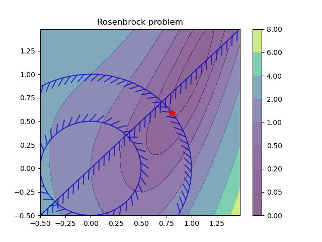  
  + <a target="_blank" href="https://colab.research.google.com/github/pnnl/neuromancer/blob/master/examples/parametric_programming/Part_2_pQP.ipynb"></a>
[Part 2](./Part_2_pQP.py): Formulating and solving two parametric quadratic programming (pQP) problems.    
  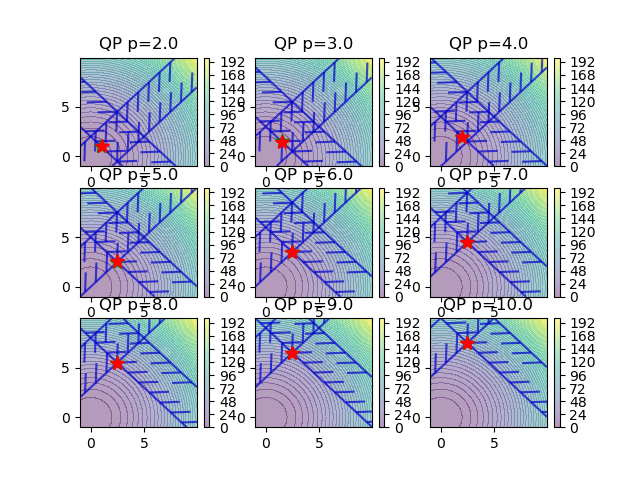 
      
  + <a target="_blank" href="https://colab.research.google.com/github/pnnl/neuromancer/blob/master/examples/parametric_programming/Part_3_pNLP.ipynb"></a>
[Part 3](./Part_3_pNLP.py): Formulating and solving a set of parametric nonlinear programming (pNLP) problems.  
  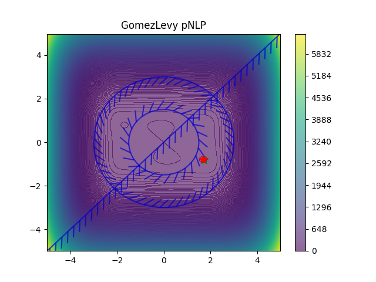 
  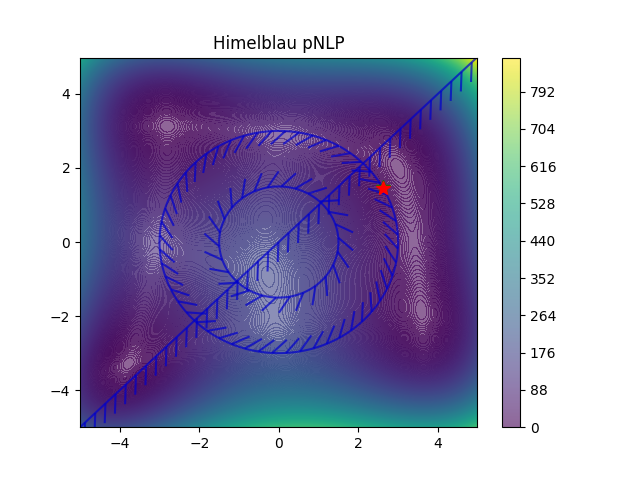
  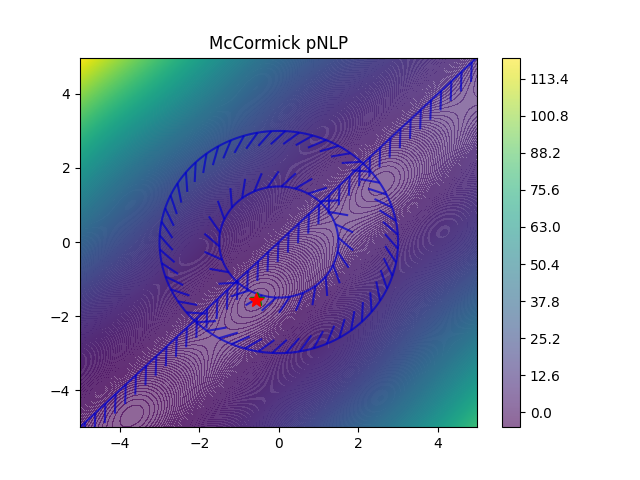
  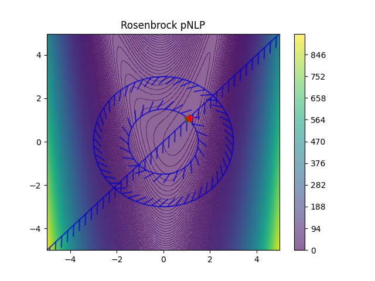
  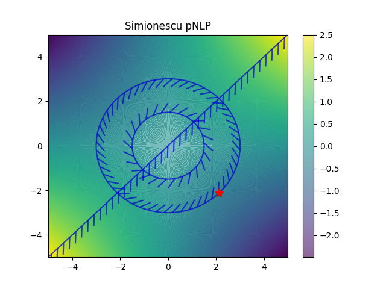
  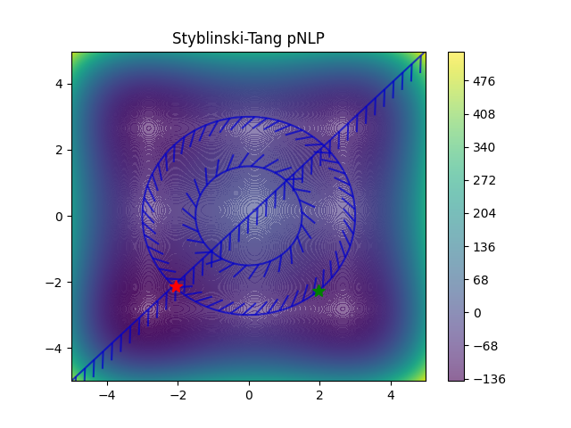
  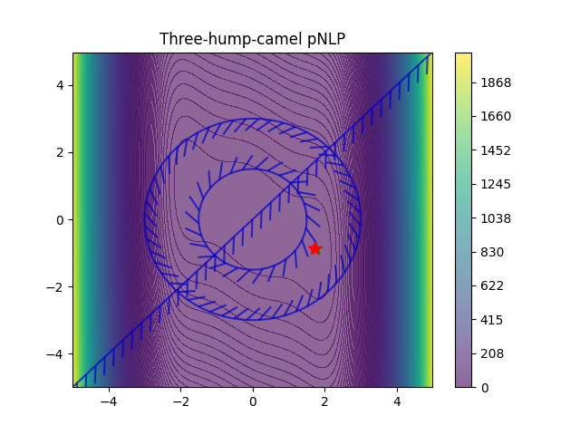
  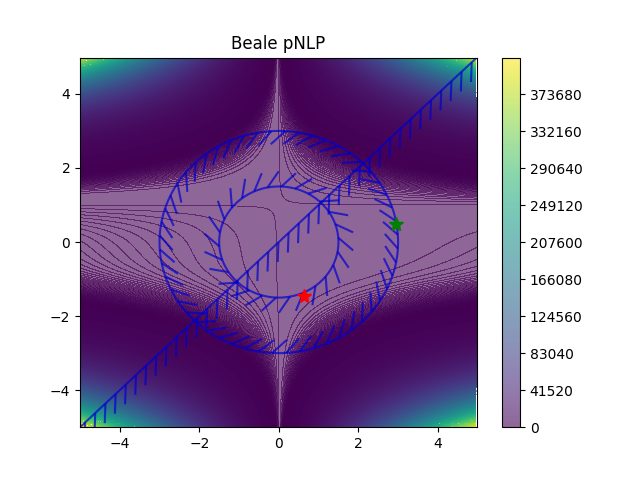  
  + <a target="_blank" href="https://colab.research.google.com/github/pnnl/neuromancer/blob/master/examples/parametric_programming/Part_4_projectedGradient.ipynb"></a>
[Part 4](./Part_4_projectedGradient.py):
Learning to solve constrained optimization problems with hard inequality constraints using the projected gradient method.  
  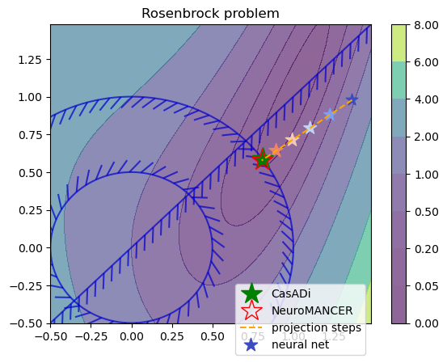  
  + <a target="_blank" href="https://colab.research.google.com/github/pnnl/neuromancer/blob/master/examples/parametric_programming/Part_5_cvxpy_layers.ipynb"></a>
[Part 5](./Part_5_cvxpy_layers.py): Using Cvxpylayers to project the pNLP solution generated by neural network onto feasible polytopic region.  
  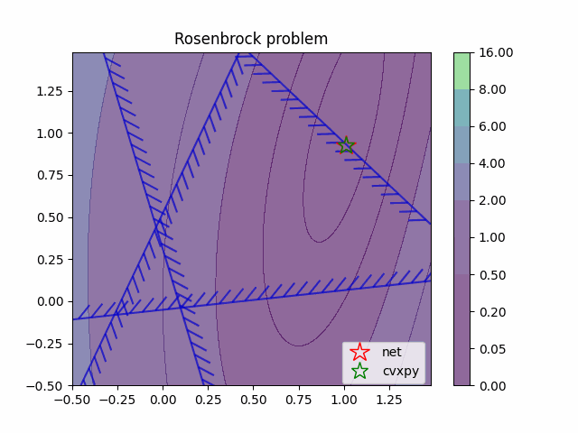  

## Related publications

- [A. Agrawal, et al., Differentiable Convex Optimization Layers, 2019](https://arxiv.org/abs/1910.12430)
- [F. Fioretto, et al., Predicting AC Optimal Power Flows: Combining Deep Learning and Lagrangian Dual Methods, 2019](https://arxiv.org/abs/1909.10461)
- [S. Gould, et al., Deep Declarative Networks: A New Hope, 2020](https://arxiv.org/abs/1909.04866)
- [P. Donti, et al., DC3: A learning method for optimization with hard constraints, 2021](https://arxiv.org/abs/2104.12225)
- [J. Kotary, et al., End-to-End Constrained Optimization Learning: A Survey, 2021](https://arxiv.org/abs/2103.16378)
- [M. Li, et al., Learning to Solve Optimization Problems with Hard Linear Constraints, 2022](https://arxiv.org/abs/2208.10611)
- [R. Sambharya, et al., End-to-End Learning to Warm-Start for Real-Time Quadratic Optimization, 2022](https://arxiv.org/abs/2212.08260)

