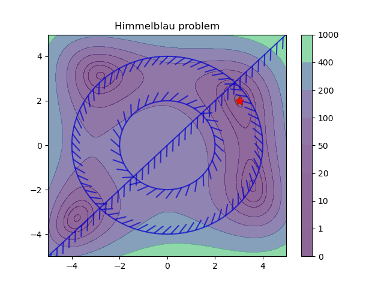
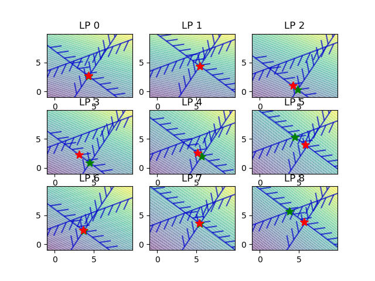
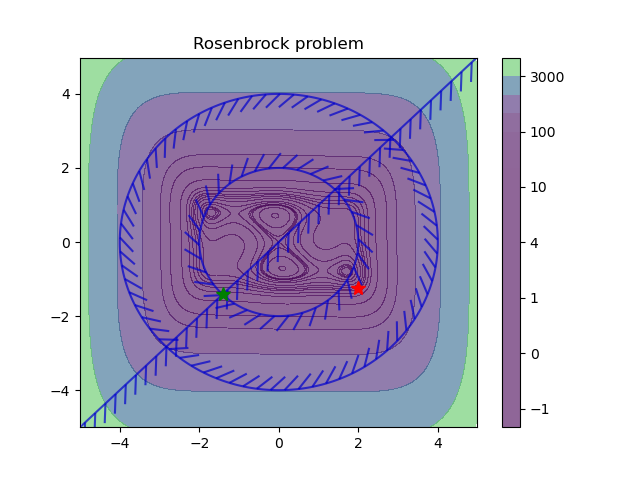
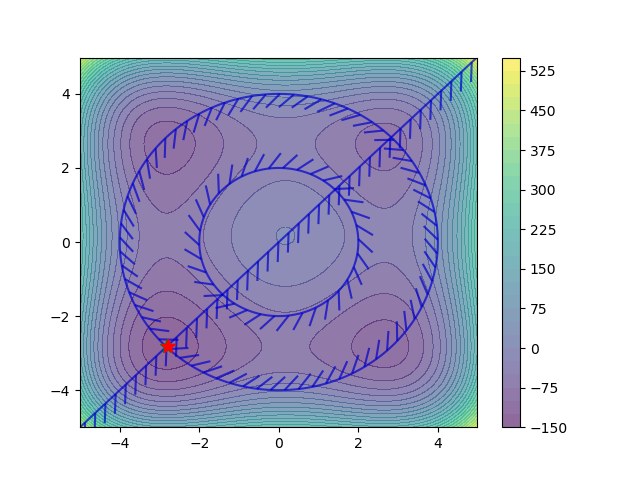
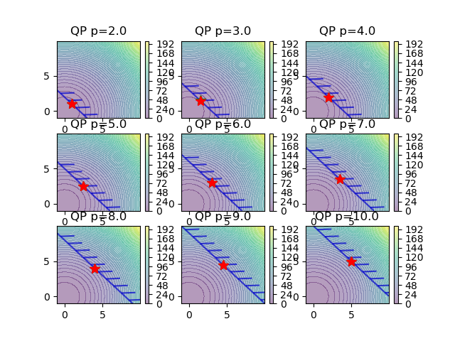
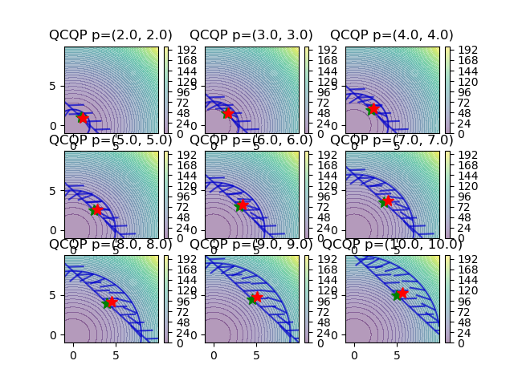

# Differentiable Parametric Programming in Neuromancer

Constrained optimization problems where the solution x depends on the varying problem parameters ξ are
called parametric programming problems. Differentiable Parametric Programming (DPP) is a set of methods
that use automatic differentiation (AD) to compute sensitivities of constrained optimization problems w.r.t.
to the problem parameters for obtaining parametric solutions of the problem

  
*Parametric sensitivity visualisation of nonlinear Rosenbrock problem 
whose solution changes with varying objective and constraints parameters. 
Green star represents solution obtained via online solver (IPOPT), 
where red star shows orders of magnitude faster solution obtained from offline DPP algorith.*

Recent years have seen a rich literature
of deep learning (DL) models for solving the constrained optimization problems on real-world tasks such
as power grid, traffic, or wireless system optimization. Earlier attempts simply adopt imitation learning
(i.e., supervised learning) to train function approximators via a minimization of the prediction error using
labeled data of pre-computed solutions using iterative solvers (i.e. IPOPT). Unfortunately, these models can
hardly perform well on unseen data as the outputs are not trained to satisfy physical constraints, leading to
infeasible solutions.
To address the feasibility issues, existing methods have been imposing constraints on the output space
of deep learning models for a subsequent differentiation using AD tools. These differentiable programming-
based methods, also called end-to-end learning, directly consider the original objectives and constraints in
the DL training process without the need of expert labeled data. 
The following figure conceptually demonstrated the difference between supervised imitation learning 
and unsupervised Differentiable Parametric Programming (DPP) which solution is obtained by 
differentiating the objectives and constraints of the parametric optimization  problem.

  
*Imitation learning VS end-to-end learning using Differentiable Parametric Programming. *

## DPP Problem Formulation
A generic formulation of the DPP is given
in the form of a parametric constrained optimization problem:
  
*DPP problem formulation.*


## Differentiable Loss Functions of Parametric Constrained Optimization Problems

There are several ways in which we can enforce the constraints satisfaction
while learning the solution π_Θ(ξ) of the differentiable constrained optimization problem (1). 
The simplest approach is to penalize the constraints violations by augmenting 
the loss function L (1a) with the penalty functions given as:
  
*DPP penalty loss function.*

Other approaches include barrier functions, or Augmented Lagrangian type methods.

## DPP Problem Solution

The main advantage of having a differentiable objective function and constraints
in the DPP problem formulation (1) is that it allows us to use automatic differentiation to directly compute
the gradients of the parametric solution map π_Θ(ξ). In particular, by representing the problem (1) as a
computational graph and leveraging the chain rule, we can directly compute the gradients of the loss function
L w.r.t. the solution map weights Θ as follows:
  
*DPP penalty loss gradients.*


## DPP Optimization Algorithm
The gradient-based solution of the DPP problem is summarized in the following Algorithm:
  
*DPP gradient-based solution algorithm.*


## DPC Syntax and Usage
The following code illustrates the implementation of Differentiable Parametric
Programming in Neuromancer:
```python 
# Tutorial example for Differentiable Parametric Programming  in Neuromancer

import torch
import neuromancer as nm
import slim 
import numpy as np

"""
# # #  Dataset 
"""
#  randomly sampled parameters theta generating superset of:
#  theta_samples.min() <= theta <= theta_samples.max()
nsim = 20000  # number of datapoints: increase sample density for more robust results
samples = {"a": np.random.uniform(low=0.2, high=1.5, size=(nsim, 1)),
           "p": np.random.uniform(low=0.5, high=2.0, size=(nsim, 1))}
data, dims = nm.get_static_dataloaders(samples)
train_data, dev_data, test_data = data

"""
# # #  multi parametric nonlinear program (mpNLP) primal solution map 
"""
func = nm.blocks.MLP(insize=2, outsize=2,
                bias=True,
                linear_map=slim.maps['linear'],
                nonlin=nm.activations.activations['relu'],
                hsizes=[80] * 4)
sol_map = nm.maps.Map(func,
        input_keys=["a", "p"],
        output_keys=["x"],
        name='primal_map')
"""
# # #  mpNLP objective and constraints formulation in Neuromancer
"""
# variables
x = nm.variable("x")[:, [0]]
y = nm.variable("x")[:, [1]]
# sampled parameters
p = nm.constraints.variable('p')
a = nm.constraints.variable('a')

# weight factors
Q_con = 100.
Q = 1.

# objective function
f = (1-x)**2 + a*(y-x**2)**2
obj = f.minimize(weight=Q, name='obj')

# constraints
con_1 = (x >= y)
con_2 = ((p/2)**2 <= x**2+y**2)
con_3 = (x**2+y**2 <= p**2)

# constrained optimization problem construction
objectives = [obj]
constraints = [Q_con*con_1, Q_con*con_2, Q_con*con_3]
components = [sol_map]

# use projected gradient update
projection = nm.solvers.GradientProjection(constraints, input_keys=["x"], num_steps=5, name='proj')
components.append(projection)

# create constrained optimization loss
loss = nm.loss.PenaltyLoss(objectives, constraints, train_data)
# construct constrained optimization problem
problem = nm.problem.Problem(components, loss, grad_inference=True)
# plot computational graph
problem.plot_graph()

"""
# # #  mpNLP problem solution in Neuromancer
"""
optimizer = torch.optim.AdamW(problem.parameters(), lr=0.001)
# define trainer
trainer = nm.trainer.Trainer(
    problem,
    train_data,
    dev_data,
    test_data,
    optimizer,
    epochs=1000,
    train_metric="train_loss",
    dev_metric="dev_loss",
    test_metric="test_loss",
    eval_metric="dev_loss",
)

# Train mpNLP solution map
best_model = trainer.train()
best_outputs = trainer.test(best_model)
# load best model dict
problem.load_state_dict(best_model)
```


List of Neuromancer classes required to build DPC:

**dataset** - classes for instantiating Pytorch dataloaders with training evaluation and testing samples:
https://github.com/pnnl/neuromancer/blob/master/neuromancer/dataset.py

**constraints** - classes for defining constraints and custom physics-informed loss function terms: 
https://github.com/pnnl/neuromancer/blob/master/neuromancer/constraint.py

**solvers**  -  implementation of iterative solvers for hard constraints such as gradient projection method: 
https://github.com/pnnl/neuromancer/blob/master/neuromancer/solvers.py

**loss** - class aggregating all instantiated constraints and loss terms 
in a scalar-valued function suitable for backpropagation-based training:
https://github.com/pnnl/neuromancer/blob/master/neuromancer/loss.py

**problem** - class agrregating trainable components (policies, dynamics, estimators)
with loss functions in a differentiable computational graph representing 
the underlying constrained optimization problem: 
https://github.com/pnnl/neuromancer/blob/master/neuromancer/problem.py


## DPP Examples

Scripts for various types of differentiable constrained optimization of parametric programs.
    + mpNLP_Himmelblau_nm.py: Solve the Himmelblau problem, formulated as the NLP using Neuromancer
        - 
    + mpQP_nm_2.py: Multi-parametric Quadratic Programming (mpQP) problem using Neuromancer.
        - 
    + mpLP_nm_1.py: Solve Linear Programming (LP) problem using Neuromancer.
        - 
    + mpNLP_GomezLevy_nm.py: Solve the Gomez and Levy function problem, formulated as the NLP using Neuromancer.
        - 
    + mpNLP_StyblinskiTang_nm.py: Solve the Styblinski–Tang problem, formulated as the NLP using Neuromancer.
        -    
    + mpQP_nm_1.py: Multi-parametric Quadratic Programming (mpQP) problem using Neuromancer
        - 
    + mpNLP_Rosenbrock_nm.py: Solve the Rosenbrock problem, formulated as the NLP using Neuromancer
        -    
    + mpQCQP_nm_1.py: Multi-parametric quadratically constrained quadratic program (mpQCQP) problem using Neuromancer
        - 

## Cite as

```yaml
@article{Neuromancer2022,
  title={{NeuroMANCER: Neural Modules with Adaptive Nonlinear Constraints and Efficient Regularizations}},
  author={Tuor, Aaron and Drgona, Jan and Skomski, Mia and Koch, James and Chen, Zhao and Dernbach, Stefan and Legaard, Christian Møldrup and Vrabie, Draguna},
  Url= {https://github.com/pnnl/neuromancer}, 
  year={2022}
}
```

